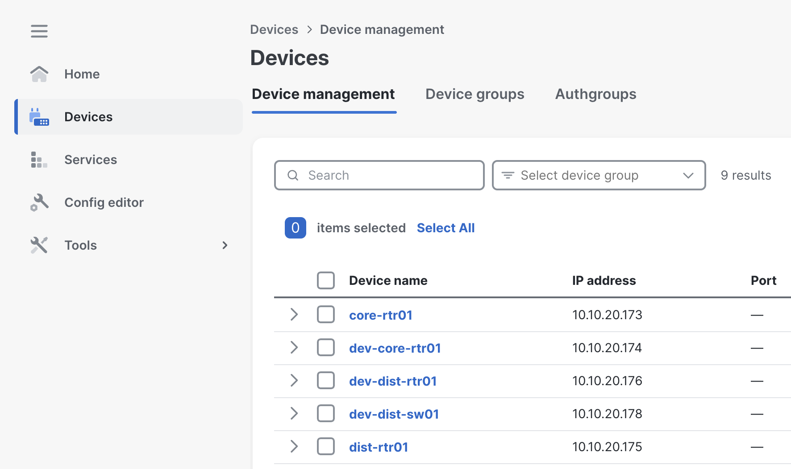
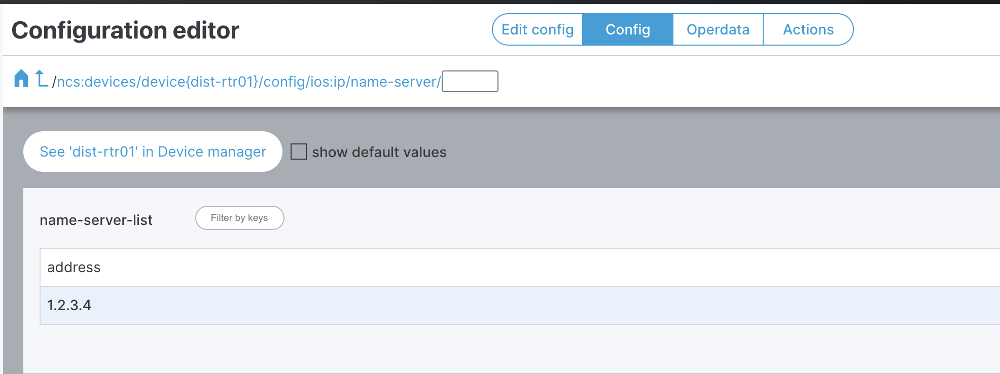
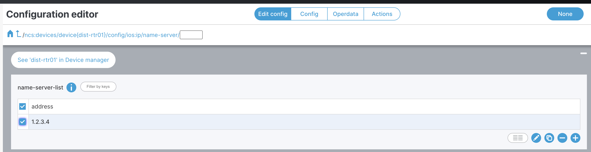
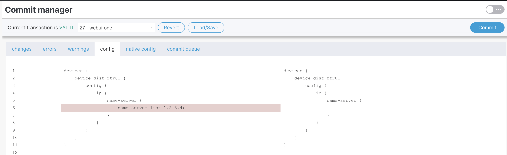

### 3 - Make changes in the device

> We will now delete the changes done by the service in the device.

Navigate to <b>Devices</b> and click on <b>dist-rtr01</b>

<small></small>

Navigate to the DNS configuration

<b>config</b> -> <b>ip</b> -> <b>name-server</b>

<small></small>

Click on <b>Edit config</b>, select the server address and hit <b>-</b> button

<small></small>

You should see 2 changes pending

<small></small>

We can notice the config diff. We're deleting the service config manually. Hit <b>Commit</b> and then <b>Yes, commit</b>

<small></small>
