# DEVWKS-2083 - The Journey of Automating Network Compliance using Cisco NSO

 <small></small>

### 🚀 Welcome to the Workshop!

Welcome to your hands-on workshop on automating network compliance with Cisco NSO.
You’ll learn how to create, audit, and remediate compliance across your network devices—empowering you to maintain a secure and consistent environment.
___

##### 🛠️ Getting Started

###### Before you begin:

<b>VPN:</b> Ensure your Cisco VPN connection is active.
<b>Web UI:</b> http://10.10.20.47:8080/

###### Credentials:

| username        | password           | 
| ------------- |:-------------:| 
| admin      | admin | 

### 1 - Devices in-sync

>Before performing an audit, NSO must have the latest configuration from the network (the "Source of Truth").

###### Steps:

Navigate to the <b>Devices</b> list in the main menu

<small></small>

<b>Select all</b> devices.

<small></small>

Click the <b>Choose actions</b> dropdown and select <b>Sync From</b>. This pulls the device configurations into the NSO CDB (Configuration Database).

<small></small>

Once the sync is complete, click <b>Done</b>.

### 2 - Creating a Compliance Template

>A Compliance Template defines the intended state of your network.

Open the <b>Configuration Editor</b>.

<small></small>

Select the <b>ncs:compliance</b> module.

<small></small>

Click <b>Edit Config</b> (top bar), then click the <b>+ (Plus)</b> button.

<small></small>

Name the template: ntp_check.

<small></small>

><b>Candidate Config:</b> Green bars indicate changes are staged as a "candidate" configuration. They are not active until you click <b>Commit</b>.

Click on the ntp_check template and click the + button.

<small></small>

><b>NED (Network Element Driver)</b>: creates de Device Abstraction Layer in NSO. Translating the User intent to the device specific language. (e.g., ASA, IOS, IOSXR, NX, ... ).

Select the NED: cisco-iosxr-cli-7.65 and click <b>Confirm</b>.

<small>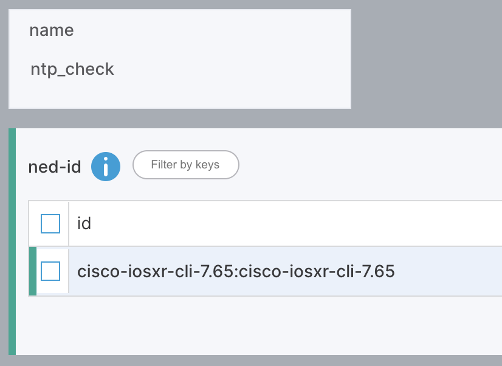</small>

Navigate to the NTP path: ncs:compliance/template{ntp_check}/ned-id{cisco-iosxr-cli-7.65}/config/cisco-ios-xr:ntp/

Configure the following:
<b>Max Associations:</b> 10

<small></small>

<b>Peer Address:</b> 1.1.1.1

<small></small>

<b>Commit Changes:</b> Click the <b>Launchpad</b> icon (top right) 

<small></small>

<b>Config</b> tab 

<small>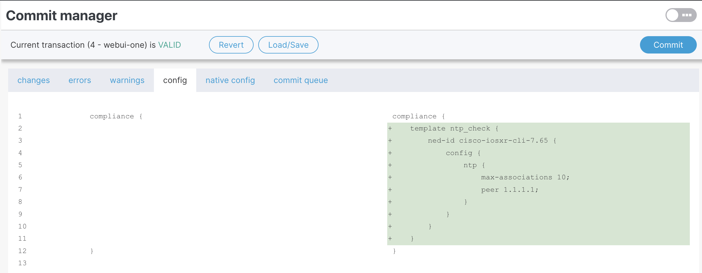</small>

We can see, in green, what is the config we are checking.

<b>Commit</b> -> <b>Yes, commit</b>.

<small></small>

>Note : If we wish to make checks on other types of devices we just need to repeat the same process, by adding a different type of NED.

### 2 - Create the Compliance Report ( Auditing )

>Now we check the actual network state against our ntp_check template.

Go to <b>Tools</b> -> <b>Compliance Reports</b>.

<small>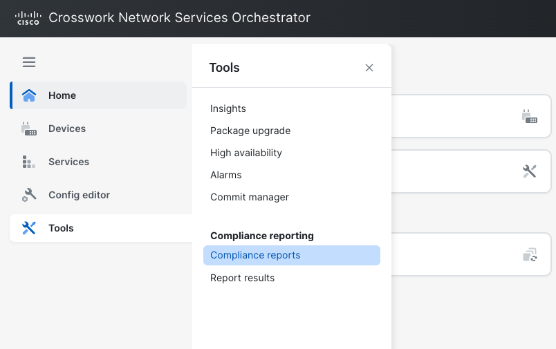</small>

Click <b>+ New report</b>

<small></small>

name it ntp_report, and click <b>Create</b>.

<small>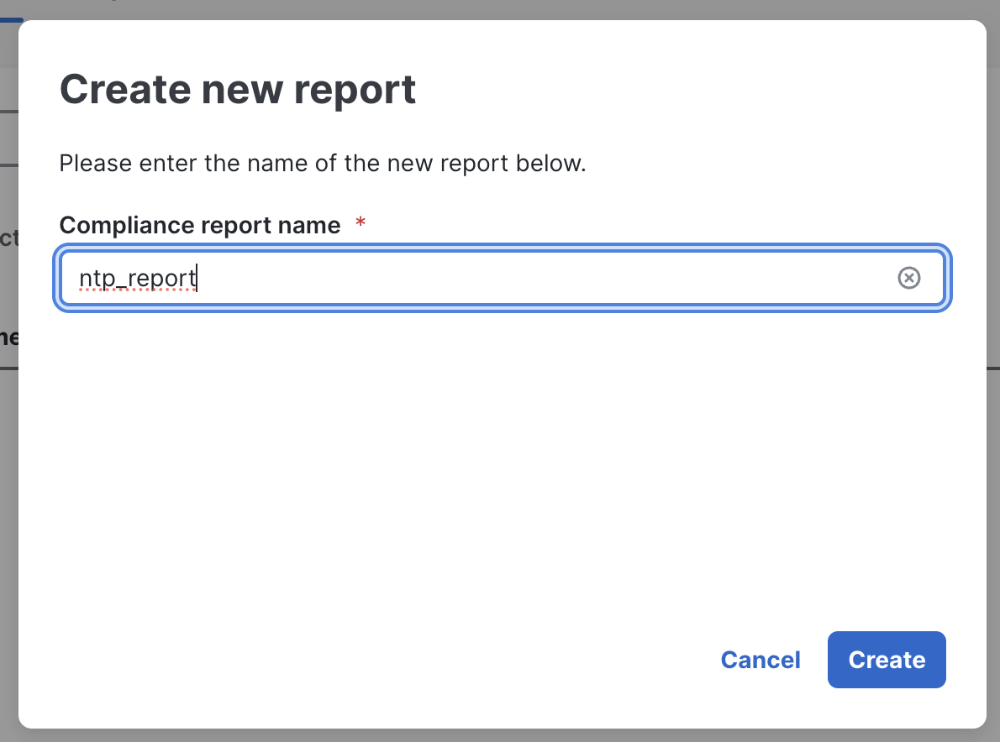</small>

In the <b>Devices</b> tab, select <b>All devices</b>.

<small></small>

Scroll to <b>Compliances</b>, click <b>Add Template</b>

<small>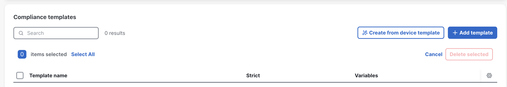</small>

Select the "ntp_check" Template we've created.

<small>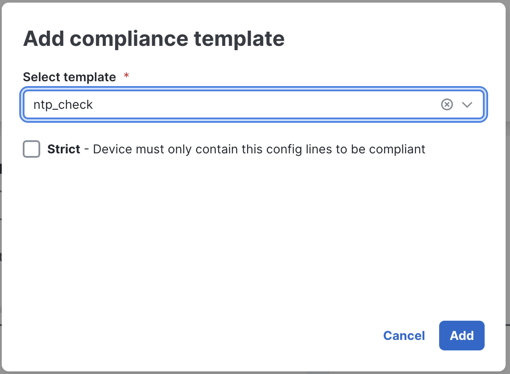</small>

Scroll Up and hit the <b>"Create Report"</b> button. Your page should look like this.

<small></small>

Your Report is ready to run. Click on <b>"Save Report"</b> button.

<small></small>

Name the run ntp_run and click <b>Run report</b>.

<small></small>

Click on <b>"Run Report"</b> button.

Click the <b>Report</b> results link in the pop-up or find it under <b>Tools -> Report results</b>.

<small></small>

Your window should show up like this.

We can notice we've some violations.

Click on the report execution name "ntp_run" to see the details.

<small>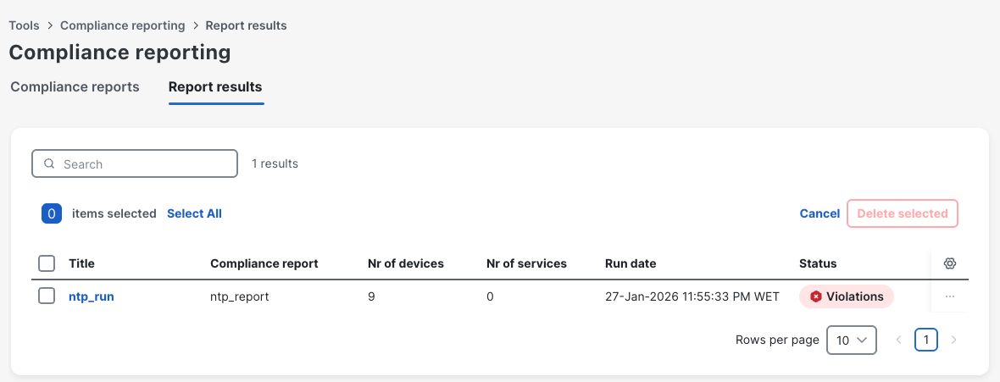</small>

Looking at the result, we can see our network of 9 devices is 78% compliant. 

Only 2 devices are not compliant.

<small></small>

Click <b>View details</b> on a "Not Compliant" device to see exactly what configuration is missing.

<small></small>

>Now, there are 2 ways to Remediate.
>
>1 - If we're testing the Compliance Report agaisnt an NSO Service, we can just click on "Re-Deploy" action button and the Devices will be automatically compliant.
>
>2 - Since we're testing the Compliance Report agaisnt a Compliance Template, we will create a Device Template and Apply to the Devices.
>
>There is always a third option, which is, inserting the configurations in the device manually, but, we were going the automation path. In this use case, might be just some couple of lines, but following a true compliance check might result in multiple different types of missing configurations across devices.

### 3 - Create a Device Template ( Remediation )

To fix it, we create a Device Template.

Double-click on <b>"Config Editor"</b> located on the left menu. 

Select the <b>"ncs:devices"</b> module

<small></small>

Click <b>Edit-Config</b>

<small></small>

<b>Template</b> -> <b>+ (Plus)</b>.

<small>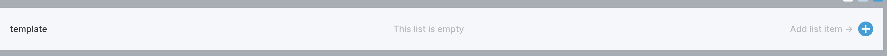</small>

Name it ntp_remediation and click <b>Confirm</b>.

<small>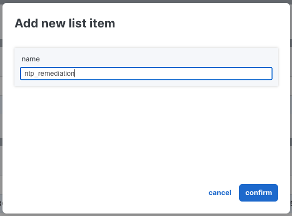</small>

Click on it

<small>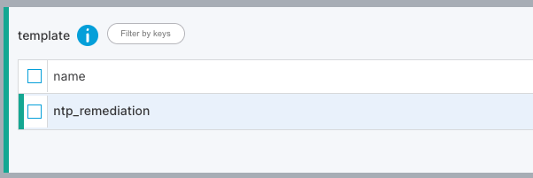</small>

Select the cisco-iosxr-cli-7.65 NED.

<small></small>

Click on the ned-id "cisco-iosxr-cli-7.65:cisco-iosxr-cli-7.65" to create the remediation configurations. Then "config".

<small></small>

Set the NTP values: <b>Max-associations</b> (10) and <b>Peer Address</b> (1.1.1.1).

<small>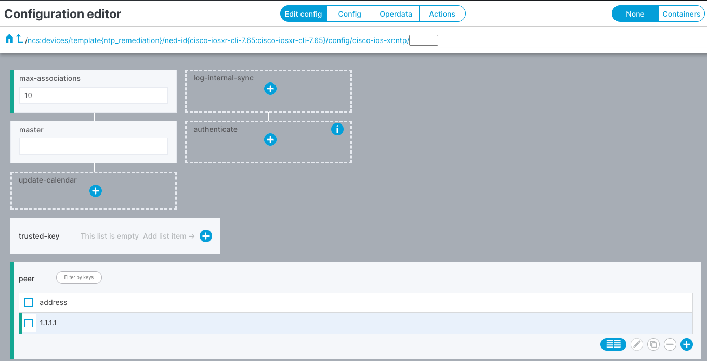</small>

After finishing our remediation template. We will click on our <b>launchpad ( top right )</b> to commit the changes.

<small></small>

We can confirm the changes and hit <b>"Commit"</b> and then "Yes, commit"

<small>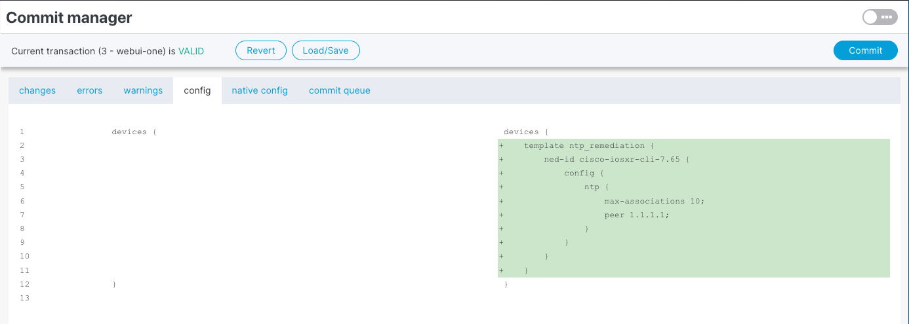</small>

### 4 - Apply the Remediation Template

To apply the template, we go to <b>"Devices"</b> menu. 
Select the devices we want to apply the template.
Then, <b>"Choose actions"</b> and then <b>"Apply template"</b>

<small></small>

We select the template and hit <b>"Apply"</b>

<small>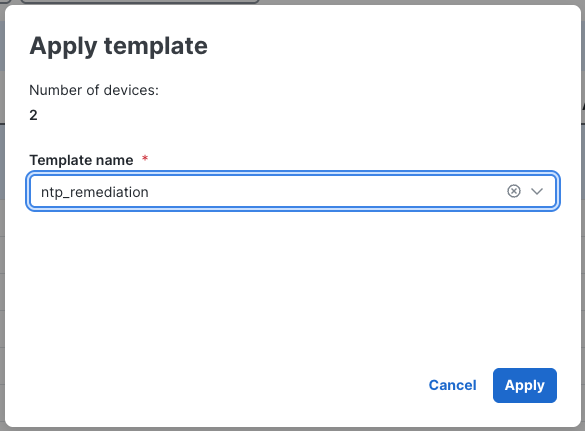</small>

We should see "result ok" message. Then hit, <b>"Done"</b>

<small></small>

Taking a look at our <b>launchpad</b> ( top right ). We see that we now have 14 changes pending.

<small></small>

We can see that NSO will automatically apply the changes from the template to the devices.

>NSO is smart and will only apply the needed changes, for example, if one device already had "max-associations" configured, NSO would skip that lines from the template for that device.

<small>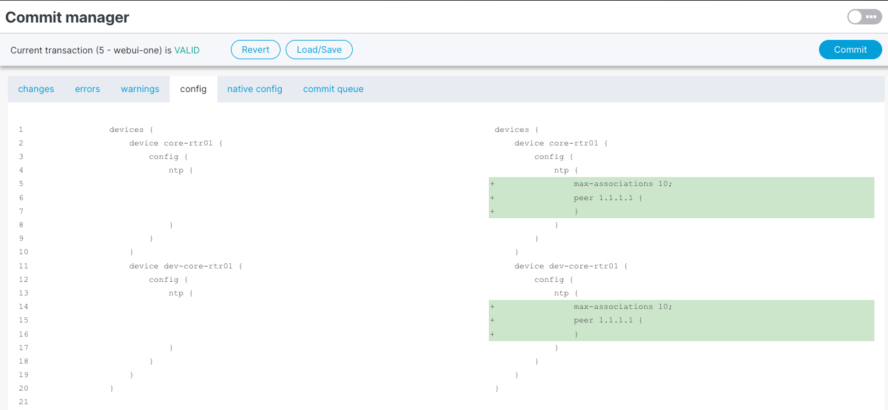</small>

We now, click on <b>"Commit"</b> and then <b>"Yes, commit"</b>. You should see the message, "Commit finished...roolback id..."

This another great advantage of NSO. every change can be reverted, easily.

<small>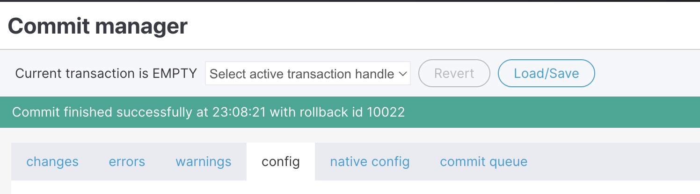</small>

### 5 - Re-run the Report

Go to <b>"Tools"</b> -> <b>"Compliance reports"</b>
Click on the "..." on the right of the screen ( report line ) and then "Run"

<small>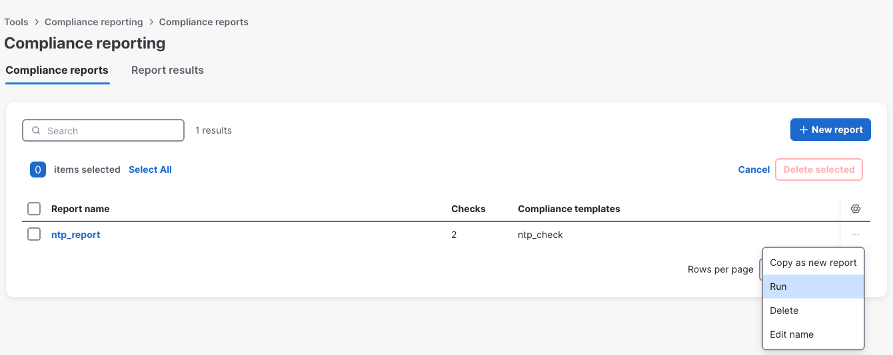</small>

Give it a name, like "ntp_run_2" and hit <b>"Run report"</b>

<small>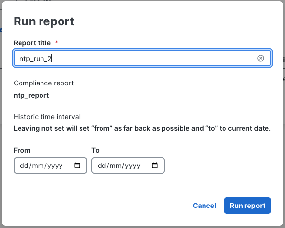</small>

Let's see the "Report Results"

<small></small>

You can see that we're now with <b>"No violation"</b>, which by other words mean "Compliant"

<small>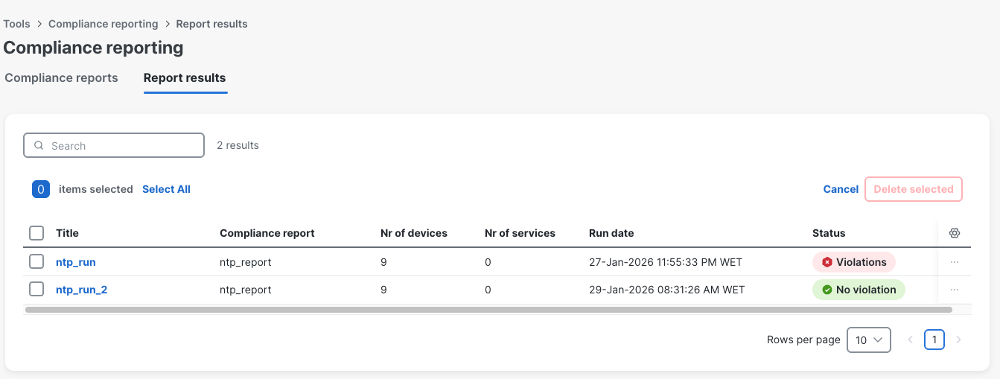</small>

Opening the Report we can see that we're <b>full compliant</b>.

<small></small>

>There is as well the option to export the reports to <b>PDF</b> (top) formats so they can be leveraged for internal usage.

Thank you so much !

  Built with ❤️ by Cisco CX Automation Team | Cisco Live 2026

