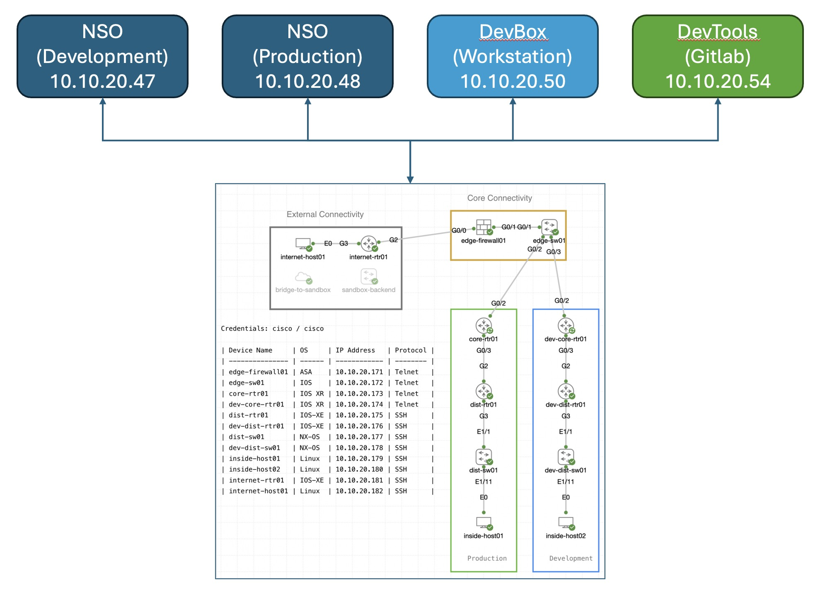

# DEVWKS-2083 - The Journey of Automating Network Compliance using Cisco NSO

 <small></small>

### Welcome to the Workshop!

Welcome to your hands-on workshop on automating network compliance with Cisco NSO.
You'll learn how to create, audit, and remediate compliance across your network devices—empowering you to maintain a secure and consistent environment.
___

##### Getting Started

###### Before you begin:

<b>VPN:</b> Ensure your Cisco VPN connection is active.

<b>Web UI:</b> <a target="_blank" href="http://10.10.20.47:8080/">NSO Development</a>

###### Credentials:

| username        | password           | 
| ------------- |:-------------:| 
| developer      | C1sco12345 | 

---

## **Lab Topology**

---

Here's a brief overview of the dCloud setup used in this lab:

- **Development NSO:** The development NSO deployment manages network devices within the CML.
- **Production NSO:** The main NSO deployment manages network devices within the CML.
- **Developer Workstation (DevBox):** A Linux VM for developing new services, running tests, and initiating pipelines.
- **Developer Tools (DevTools):** Another Linux VM equipped with various tools needed for lab activities.

<small></small>
