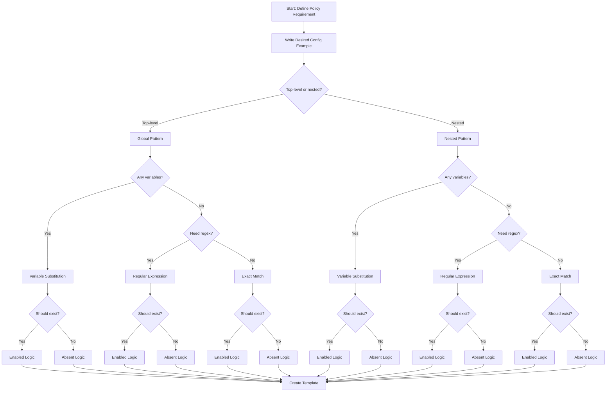

# Understanding Compliance Patterns

**⏱️ Estimated time: 2 minutes**

When creating compliance checks, several patterns emerge. Understanding these patterns will help you design effective compliance templates for your specific policy requirements.

A compliance check can generally be described by **three characteristics**:

1. **Match Type** - Required conditions for a given configuration to be matched
2. **Match Logic** - How a given configuration is evaluated
3. **Match Pattern** - The scope of a given configuration match

---

## Match Type

The **match type** determines the conditions required for a configuration to be matched. This influences how you write the template and whether you need variables or regular expressions.

### Exact Match

An exact string match of the configuration line. Use this when the configuration must be precisely as specified.

**Example:**
```text
service password-encryption
```

**When to use:** Configuration commands that have no variables or options.

---

### Variable Substitution

A configuration line with values that may vary per device, location, or environment. Templates use variables that are substituted at runtime.

**Example:**
```text
clock timezone EST -5
```

In this example, both the timezone name (`EST`) and offset (`-5`) might vary by location. You would create variables like `$TIMEZONE` and `$OFFSET_HOURS`.

**When to use:** 
- Regional settings (timezones, NTP servers)
- Device-specific values (loopback IPs, hostnames)
- Environment-specific settings (dev vs. prod)

---

### Regular Expression Match

A configuration line with a value that matches a pattern or criteria. Use regex to validate ranges, formats, or options.

**Example:**
```text
login block-for 900 attempts 3 within 120
```

The specific numbers might vary, but you want to ensure that login blocking is configured. You might use a regex like:

```text
login block-for [0-9]+ attempts [0-9]+ within [0-9]+
```

**When to use:**
- Validating numeric ranges
- Checking for any value from a set of options
- Pattern matching (IP addresses, ACL entries)

---

## Match Logic

The **match logic** determines how a configuration is evaluated. This affects how NSO interprets the presence or absence of configuration elements.

### Enabled Feature

A configuration line that must be present and enabled in the running configuration.

**Example:**
```text
service password-encryption
```

✅ **Pass:** Configuration exists and is enabled  
❌ **Fail:** Configuration is absent or disabled

**When to use:** Checking that required security or operational features are turned on.

---

### Disabled Feature

A configuration line that must be present but explicitly disabled (using `no` prefix).

**Example:**
```text
no mpls ip propagate-ttl
```

✅ **Pass:** Configuration explicitly shows `no mpls ip propagate-ttl`  
❌ **Fail:** Feature is enabled or setting is default

**When to use:** Ensuring potentially risky features are explicitly disabled.

---

### Absent Configuration

A configuration line that must **not** exist in the running configuration.

**Example:**
```text
service ipv4 tcp-small-servers
```

✅ **Pass:** Configuration does not appear anywhere  
❌ **Fail:** Configuration is present (enabled or disabled)

**When to use:** 
- Prohibited legacy services
- Insecure protocols
- Deprecated features

!!! warning "Absent vs. Disabled"
    **Absent** means the configuration line doesn't exist at all.  
    **Disabled** means the configuration has `no` prefix but is explicitly present.  
    These are different checks!

---

### Comparison Operations

A configuration that requires counting or comparing values (e.g., "at least 2 NTP servers").

**Example:**
```text
ntp server 1.1.1.1
ntp server 2.2.2.2
```

✅ **Pass:** Two or more NTP servers configured  
❌ **Fail:** Fewer than two NTP servers

**When to use:**
- Redundancy requirements
- Minimum/maximum value enforcement
- List length validation

---

## Match Pattern

The **match pattern** determines the scope and context of the configuration match. This affects how you structure your template.

### Global Configuration

A configuration line found at the global (top-level) configuration.

**Example:**
```text
service password-encryption
```

**Template structure:** Simple, single-level check

**When to use:** System-wide settings like services, global timeouts, logging

---

### Nested Configuration

A configuration line found under a parent configuration context.

**Example:**
```text
interface GigabitEthernet0/1
  no ip unreachables
```

The `no ip unreachables` command is nested under a specific interface.

**Template structure:** Must specify the parent context (interface) and the nested setting

**When to use:**
- Interface-specific settings
- Routing protocol configurations
- VRF or VPN configurations

---

### Configuration List

A configuration contained within a list of items, where you need to check specific entries.

**Example:**
```text
ip access-list extended PROTECT-IN
  deny ip any any option any-options
  deny ip any any fragments
  permit ip any any
```

You might need to verify that specific deny statements exist in the ACL.

**Template structure:** Reference the list container and specify required entries

**When to use:**
- Access control lists
- Prefix lists
- Route maps
- Community lists

---

### Configuration Section (Multiple Lines)

A configuration that spans multiple related lines that must appear together.

**Example:**
```text
archive
  log config
    logging enable
```

All three lines form a complete configuration section for logging configuration changes.

**Template structure:** Include all related lines as a block with proper hierarchy

**When to use:**
- Multi-line feature configurations
- Related settings that must all be present
- Configuration blocks with dependencies

---

## Combining Patterns

Real-world compliance templates often combine multiple patterns. Let's look at some examples:

### Example 1: Nested + Variable + Regex

**Requirement:** Ensure loopback0 IP addresses are from the 10.0.100.0/24 subnet.

- **Match Pattern:** Nested (under interface)
- **Match Type:** Regular expression (IP range)
- **Match Logic:** Enabled feature

```text
interface Loopback0
  ip address 10.0.100.[0-9]+ 255.255.255.255
```

### Example 2: Configuration Section + Variable + Strict

**Requirement:** Ensure console line has standard security configuration.

- **Match Pattern:** Configuration section
- **Match Type:** Variable (auth method name)
- **Match Logic:** Strict match (only these lines)

```text
line console 0
  exec-timeout 5 0
  login authentication $AUTH_METHOD
```

### Example 3: List + Regex + Enabled

**Requirement:** Ensure ACL denies packets with IP options.

- **Match Pattern:** Configuration list
- **Match Type:** Regular expression
- **Match Logic:** Enabled feature

```text
ip access-list extended $ACL_NAME
  deny ip any any option any-options
```

---

## Pattern Selection Guide

Use this decision tree to select the right pattern combination:



---

## Summary Table

| Match Type | Match Logic | Match Pattern | Example Use Case |
|------------|-------------|---------------|------------------|
| Exact | Enabled | Global | `service password-encryption` must be on |
| Variable | Enabled | Global | Timezone must be configured (varies by site) |
| Regex | Enabled | Nested | Interface IPs must be from specific subnet |
| Exact | Absent | Global | Legacy services must not exist |
| Exact | Disabled | Nested | HTTP server must be explicitly disabled |
| Regex | Enabled | List | ACL must contain specific deny rule |
| Variable | Enabled | Section | Console line must have standard config |

---

## Next Steps

Now that you understand compliance patterns, you're ready to start building actual compliance templates in the lab exercises.

[Start the Lab Guide →](../lab-guide/setup.md){ .md-button .md-button--primary }
[Skip to Template Reference →](../reference/template-examples.md){ .md-button }
