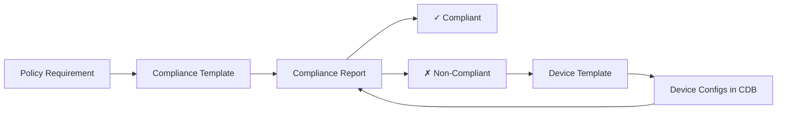
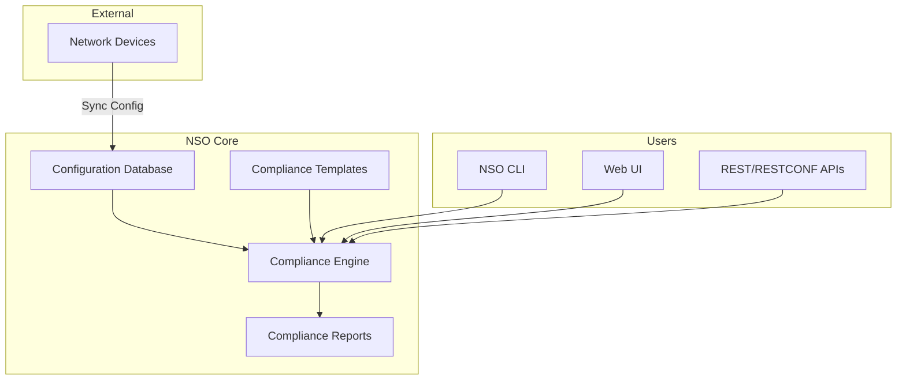

# Introduction to NSO Compliance Reporting

**⏱️ Estimated time: 3 minutes**

## What is Network Compliance?

Network compliance refers to ensuring that network devices adhere to established security policies, operational standards, and regulatory requirements. Traditional compliance auditing is often a manual, time-consuming process that involves:

- Logging into devices individually
- Running show commands to inspect configurations
- Comparing outputs against policy documents
- Documenting violations in spreadsheets
- Tracking remediation efforts manually

This manual approach is error-prone, doesn't scale, and provides only point-in-time visibility into compliance posture.

📸 Image Placeholder: Manual vs. Automated Compliance Workflow Comparison
 <small>Suggested: Side-by-side diagram showing manual compliance process vs. NSO automated approach</small>

---

## NSO Compliance Automation

Cisco Network Services Orchestrator (NSO) transforms compliance auditing by providing:

### :material-check-all: Automated Configuration Audits

NSO maintains a real-time copy of device configurations in its Configuration Database (CDB). This eliminates the need to connect to each device for audits and provides instant compliance visibility.

### :material-file-code: Template-Based Policy Definition

Compliance requirements are defined as templates using NSO's native data models. These templates express what configurations should (or shouldn't) exist on devices.

### :material-chart-line: Comprehensive Reporting

NSO generates detailed compliance reports showing which devices pass or fail each policy check, including specific configuration differences.

### :material-auto-fix: Automated Remediation

Once non-compliant configurations are identified, NSO can automatically push corrective configurations through device or service templates.

---

## Compliance Templates in NSO

Compliance templates were introduced in NSO 6.1 and have been continuously enhanced. They allow you to define compliance policies in a structured, vendor-neutral format.

### How Templates Work

### Key Concepts

**Compliance Templates**
:   Define the desired or prohibited configuration patterns that NSO should check for on devices.

**Compliance Reports**
:   Configuration objects in NSO that specify which templates to check against which devices.

**Report Results**
:   The output of running a compliance report, showing pass/fail status and configuration differences.

**Device Templates**
:   Used to remediate non-compliant configurations by pushing corrective changes to devices.

---

## Benefits of NSO Compliance Reporting

### :material-speedometer: Speed and Scale

- Audit thousands of devices in seconds
- Real-time compliance visibility
- No impact on production network (reads from CDB)

### :material-shield-check: Accuracy and Consistency

- Eliminate human error in audits
- Consistent policy application across all devices
- Version-controlled policy definitions

### :material-calendar-clock: Continuous Monitoring

- Run reports on-demand or on a schedule
- Track compliance trends over time
- Immediate alerting on policy violations

### :material-history: Audit Trail

- Complete history of compliance checks
- Before/after snapshots for remediation
- Regulatory reporting capabilities

---

## Use Cases

NSO compliance reporting is ideal for:

!!! example "Security Compliance"
    - Verify encryption is enabled
    - Check for disabled unused services
    - Validate authentication and authorization settings
    - Ensure proper password policies

!!! example "Operational Standards"
    - Standardize interface configurations
    - Verify routing protocol settings
    - Check logging and monitoring configuration
    - Validate QoS policies

!!! example "Regulatory Requirements"
    - PCI-DSS network security requirements
    - HIPAA network segmentation
    - SOX IT general controls
    - Industry-specific regulations

!!! example "Change Validation"
    - Pre/post-change compliance verification
    - Maintenance window validation
    - Configuration drift detection
    - Emergency change auditing

---

## NSO Architecture Context

Understanding where compliance fits into NSO's architecture helps you leverage it effectively:

**Key Points:**

1. **NEDs (Network Element Drivers)** translate vendor-specific configurations into NSO's unified model
2. **CDB** stores the current configuration state of all managed devices
3. **Compliance Engine** compares CDB data against compliance templates
4. **Reports** can be accessed via CLI, GUI, or APIs for integration with other tools

---

## Workshop Approach

In this workshop, you'll learn compliance reporting through a practical, hands-on approach:

1. **Learn the Patterns** - Understand different types of compliance checks
2. **Build Templates** - Create templates for real-world policy requirements
3. **Generate Reports** - Run compliance audits and interpret results
4. **Remediate Issues** - Use NSO to fix non-compliant configurations
5. **Automate Workflows** - Explore compliance services for continuous monitoring

---

## Next Steps

Now that you understand the fundamentals of NSO compliance reporting, let's dive into the different **compliance check patterns** that you'll use to build your templates.

[Continue to Compliance Patterns →](compliance-patterns.md){ .md-button .md-button--primary }
