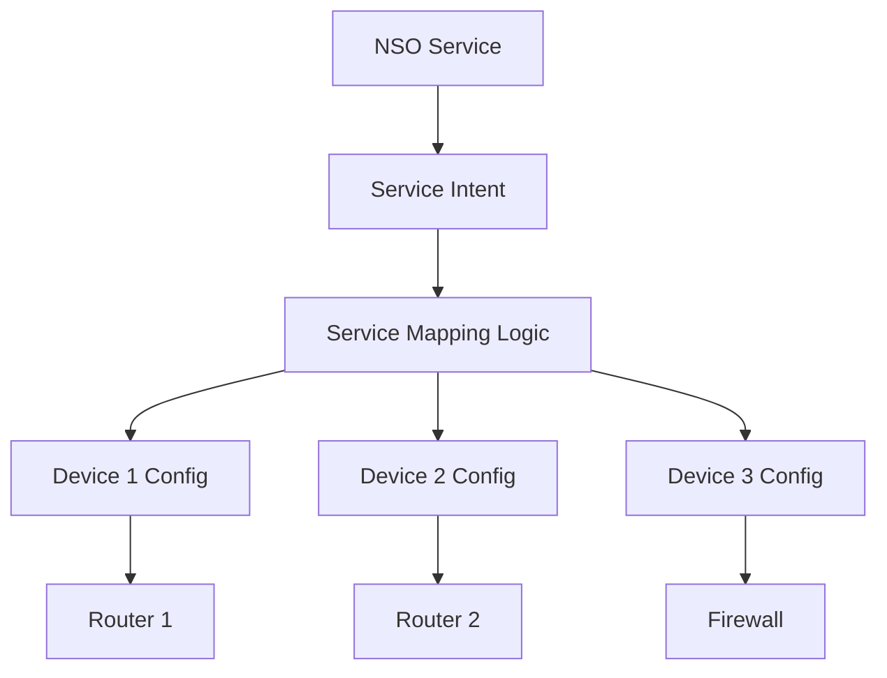
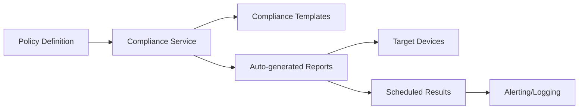
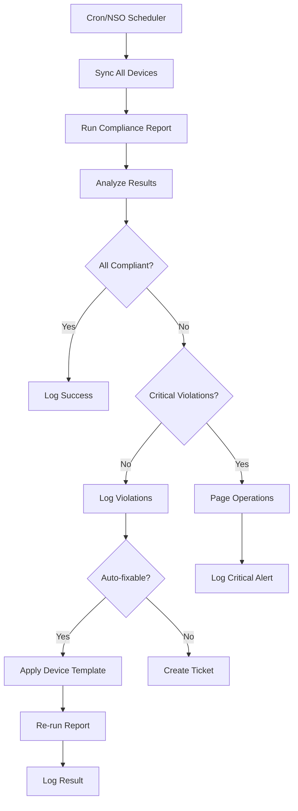
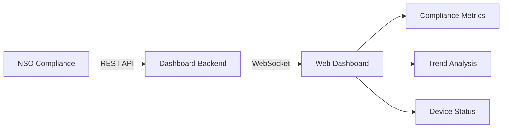

# Advanced Topics

**⏱️ Estimated time: 5 minutes** *(Optional/Bonus)*

This section covers advanced compliance reporting concepts including NSO services for compliance automation, service-level compliance checks, and continuous monitoring patterns.

!!! info "Optional Content"
    This section is optional and intended for users who want to explore advanced NSO capabilities beyond basic compliance reporting.

---

## NSO Services Overview

NSO **services** are high-level abstractions that manage configuration across multiple devices. Unlike device templates (which apply configuration directly), services maintain a relationship between the service intent and the resulting device configurations.

### Services vs. Device Templates

| Device Templates | Services |
|-----------------|----------|
| Direct configuration push | Intent-based abstraction |
| Static, one-time application | Dynamic, maintains relationship |
| No lifecycle management | Full lifecycle (create, modify, delete) |
| Single device focus | Multi-device orchestration |



---

## Compliance Service Package

The workshop repository includes an example compliance service package that demonstrates how to build continuous compliance monitoring.

### Service Architecture



---

## Exercise: Deploy Compliance Service

Let's deploy the web-secure service package, which demonstrates service-level compliance.

### Step 1: Copy Service Package to NSO

From your local machine (where you cloned the repository):

```bash
cd resources/devnet_sandbox/nso_services
scp web-secure.tar.gz developer@10.10.20.47:/nso/run/packages/
```

**Enter password:** `C1sco12345`

---

### Step 2: Extract and Reload Packages

SSH into NSO:

```bash
ssh developer@10.10.20.47 -p 2024
```

Reload NSO packages to register the new service:

```bash
developer@ncs# packages reload
```

**Expected Output:**
```
reload-result {
    package web-secure
    result true
}
```

!!! success "Package Loaded"
    The web-secure service is now available in NSO!

---

### Step 3: Create a Service Instance

**Step 1:** Enter configuration mode:
```bash
developer@ncs# config
```

**Step 2:** Load service configuration:
```bash
developer@ncs(config)# load merge terminal
```

**Step 3:** Paste the service configuration:
```
web-secure SECURE-WEB
 permitted-web-servers [ 192.168.10.100 192.168.10.101 192.168.19.102 ]
 devices dist-rtr01
  interface-type GigabitEthernet
  interface-id   2
```

**Step 4:** Press `Ctrl+D`, then review:
```bash
developer@ncs(config)# show configuration
```

**Step 5:** Commit the service:
```bash
developer@ncs(config)# commit dry-run outformat native
```

Review the native device configuration that will be generated.

**Step 6:** Commit for real:
```bash
developer@ncs(config)# commit
developer@ncs(config)# exit
```

---

### Step 4: Understand the Service

The web-secure service creates:

1. **Access Control List** - Permits only specified web servers
2. **Interface ACL Application** - Applies ACL to specified interface
3. **Security Baseline** - Ensures HTTP inspection is enabled

**View the service:**
```bash
developer@ncs# show running-config web-secure
```

**View generated device configuration:**
```bash
developer@ncs# show running-config devices device dist-rtr01 config | grep access-list
```

---

## Service-Level Compliance

NSO can check compliance not just at the device level, but at the service level. This ensures services are deployed correctly and remain intact.

### Adding Service Checks to Reports

Modify your compliance report to include service checks.

**Step 1:** Enter configuration mode:
```bash
developer@ncs# config
```

**Step 2:** Load service check configuration:
```bash
developer@ncs(config)# load merge terminal
```

**Step 3:** Paste the configuration:
```xml
<compliance xmlns="http://tail-f.com/ns/ncs">
    <reports>
    <report>
        <name>DevNet-2025</name>
        <service-check>
        <service-type>/web-secure:web-secure</service-type>
        </service-check>
    </report>
    </reports>
</compliance>
```

**Step 4:** Press `Ctrl+D`, then commit:
```bash
developer@ncs(config)# commit
developer@ncs(config)# exit
```

---

### Running Service Compliance Checks

**Via CLI:**
```bash
developer@ncs# compliance reports report DevNet-2025 run run-name service-check-1
```

**View results:**
```bash
developer@ncs# show compliance reports report DevNet-2025 run service-check-1 result
```

The report now includes:
- **Device-level checks** - Original compliance templates
- **Service-level checks** - Verification that services are correctly deployed

<div class="img-placeholder">
📸 Image Placeholder: Service Compliance Results
<br><small>Suggested: Screenshot showing service compliance tab in NSO report results</small>
</div>

---

### Service Compliance via Web UI

**Step 1:** Navigate to **Tools** → **Compliance reporting**

**Step 2:** Select the **DevNet-2025** report

**Step 3:** Click the **Services** tab

**Step 4:** Select **Some services**

**Step 5:** Add `/web-secure:web-secure` to the service-type list

**Step 6:** Click **Save report**

**Step 7:** Click **Run report**, name it `service-check-2`

**Step 8:** View results and explore the **Services** tab

---

## Continuous Compliance Monitoring

For production environments, implement continuous compliance monitoring with automated responses.

### Monitoring Architecture



---

### Implementation with Python

Example Python script for automated compliance monitoring:

```python
#!/usr/bin/env python3
"""
Automated NSO Compliance Monitoring
"""
import ncs
import logging
from datetime import datetime

def run_compliance_check(report_name):
    """Run compliance report and return results"""
    with ncs.maapi.single_read_trans('admin', 'python') as trans:
        root = ncs.maagic.get_root(trans)
        report = root.compliance.reports.report[report_name]
        
        # Generate run name with timestamp
        run_name = f"auto-{datetime.now().strftime('%Y%m%d-%H%M%S')}"
        
        # Run the report
        result = report.run(run_name=run_name)
        
        return result

def analyze_results(report_name, run_name):
    """Analyze compliance results"""
    with ncs.maapi.single_read_trans('admin', 'python') as trans:
        root = ncs.maagic.get_root(trans)
        run = root.compliance.reports.report[report_name].run[run_name]
        
        violations = []
        for device_result in run.result.device:
            if device_result.result == 'violations':
                for template in device_result.template:
                    if template.result == 'violation':
                        violations.append({
                            'device': device_result.device,
                            'template': template.name
                        })
        
        return violations

def auto_remediate(violations):
    """Attempt automatic remediation"""
    with ncs.maapi.single_write_trans('admin', 'python') as trans:
        root = ncs.maagic.get_root(trans)
        
        for violation in violations:
            device = root.devices.device[violation['device']]
            template_name = violation['template']
            
            # Apply device template if it exists
            try:
                device.apply_template(template_name=template_name)
                logging.info(f"Applied template {template_name} to {violation['device']}")
            except Exception as e:
                logging.error(f"Failed to apply template: {e}")
        
        trans.apply()

# Main monitoring loop
if __name__ == '__main__':
    logging.basicConfig(level=logging.INFO)
    
    # Run compliance check
    result = run_compliance_check('DevNet-2025')
    
    # Analyze results
    violations = analyze_results('DevNet-2025', result.run_name)
    
    if violations:
        logging.warning(f"Found {len(violations)} violations")
        # auto_remediate(violations)  # Uncomment for auto-remediation
    else:
        logging.info("All devices compliant")
```

---

## Integration with External Systems

### Webhook Notifications

Configure NSO to send webhook notifications on compliance violations:

```python
import requests
import json

def send_webhook_alert(violations):
    """Send alert to external system"""
    webhook_url = "https://your-webhook-endpoint.com/alerts"
    
    payload = {
        "alert_type": "compliance_violation",
        "timestamp": datetime.now().isoformat(),
        "violations": violations
    }
    
    response = requests.post(
        webhook_url,
        data=json.dumps(payload),
        headers={'Content-Type': 'application/json'}
    )
    
    return response.status_code
```

### Syslog Integration

Log compliance results to syslog:

```python
import syslog

def log_to_syslog(message, priority=syslog.LOG_WARNING):
    """Log compliance events to syslog"""
    syslog.openlog('nso-compliance', logoption=syslog.LOG_PID)
    syslog.syslog(priority, message)
    syslog.closelog()

# Usage
log_to_syslog("Compliance violation detected on dist-rtr01")
```

### ITSM Ticket Creation

Automatically create tickets for compliance violations:

```python
from servicenow import ServiceNow

def create_incident(violation):
    """Create ServiceNow incident"""
    sn = ServiceNow('instance', 'user', 'pass')
    
    incident = {
        'short_description': f'Compliance violation: {violation["template"]}',
        'description': f'Device {violation["device"]} failed {violation["template"]} check',
        'urgency': '2',
        'impact': '2',
        'category': 'Network',
        'subcategory': 'Compliance'
    }
    
    return sn.create_incident(incident)
```

---

## Advanced Reporting Techniques

### Custom Report Formats

Create custom report formats using NSO's reporting API:

```python
def generate_custom_report(report_name, run_name, format='html'):
    """Generate custom formatted report"""
    with ncs.maapi.single_read_trans('admin', 'python') as trans:
        root = ncs.maagic.get_root(trans)
        run = root.compliance.reports.report[report_name].run[run_name]
        
        if format == 'html':
            return generate_html_report(run)
        elif format == 'json':
            return generate_json_report(run)
        elif format == 'pdf':
            return generate_pdf_report(run)
```

### Compliance Dashboards

Build real-time compliance dashboards:



---

## Best Practices for Production

!!! tip "Production Deployment Tips"
    1. **Schedule regular checks** - Run compliance reports daily or weekly
    2. **Define severity levels** - Categorize violations by criticality
    3. **Implement gradual rollout** - Start with read-only monitoring
    4. **Enable audit logging** - Track all compliance actions
    5. **Create runbooks** - Document remediation procedures
    6. **Test in non-production** - Validate automation before production use
    7. **Monitor the monitor** - Ensure compliance system itself is healthy

!!! warning "Security Considerations"
    - Limit auto-remediation scope (whitelist specific templates)
    - Require approval for critical changes
    - Implement change windows for remediation
    - Maintain audit trail of all actions
    - Use NSO RBAC to control access

---

## Compliance as Code

Treat compliance policies as code:

```yaml
# compliance-policy.yaml
policies:
  - name: security-baseline
    category: security
    severity: high
    templates:
      - LOGIN-POLICY
      - ENABLE-SECRET
      - NO-ENABLE-PASSWORD
      - NO-HTTP
    
  - name: operational-standards
    category: operations
    severity: medium
    templates:
      - LOOPBACK0
      - ROUTER-ID
    
  - name: access-control
    category: security
    severity: high
    templates:
      - NO-AUX
```

Version control your compliance definitions and automate deployment.

---

## Summary

You've explored advanced compliance topics including:

- ✅ NSO services and service-level compliance
- ✅ Continuous compliance monitoring patterns
- ✅ Integration with external systems
- ✅ Automated remediation workflows
- ✅ Custom reporting and dashboards
- ✅ Production deployment best practices
- ✅ Compliance as code

---

## Additional Resources

!!! info "Further Learning"
    - **NSO Documentation:** [developer.cisco.com/docs/nso](https://developer.cisco.com/docs/nso/)
    - **NSO DevNet Sandbox:** Reserve your own instance at [devnetsandbox.cisco.com](https://devnetsandbox.cisco.com)
    - **NSO GitHub:** Example code and packages at [github.com/NSO-developer](https://github.com/NSO-developer)
    - **DevNet Community:** Join discussions at [community.cisco.com](https://community.cisco.com)

---

## Workshop Complete!

🎉 **Congratulations!** You've completed the Cisco NSO Compliance Reporting Workshop!

You now have the skills to:
- Build compliance templates for various patterns
- Generate comprehensive compliance reports
- Remediate violations using device templates
- Implement continuous compliance monitoring
- Integrate compliance workflows with external systems

### What's Next?

- Explore the [Template Library](../reference/template-library.md) for more examples
- Build compliance automation for your own environment
- Share your knowledge with colleagues
- Contribute to the NSO community

---

<div style="text-align: center; margin-top: 2em;">
  <h3>Thank you for participating!</h3>
  <p>Please provide feedback to help improve this workshop.</p>
  <a href="../index.md" class="md-button md-button--primary">Return to Home</a>
  <a href="../reference/template-examples.md" class="md-button">Browse Templates</a>
</div>

---

[Back to Remediation →](remediation.md){ .md-button }
[Browse Template Library →](../reference/template-library.md){ .md-button .md-button--primary }
