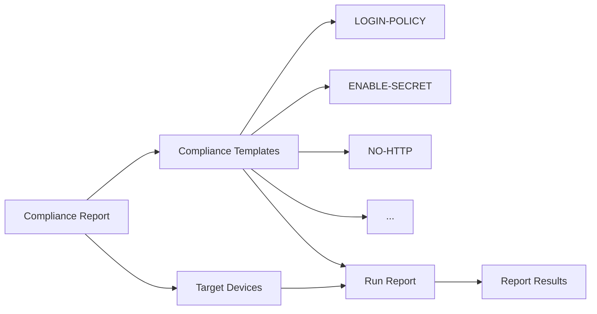

# Generating Compliance Reports

**⏱️ Estimated time: 8 minutes**

Now that you've created compliance templates, it's time to generate comprehensive compliance reports. NSO compliance reports bring together multiple templates and execute them against specified devices, providing detailed visibility into your network's compliance posture.

---

## Understanding Compliance Reports

A compliance report in NSO is a configuration object that defines:

- **Which devices** to check (individual devices or device groups)
- **Which templates** to apply (one or more compliance templates)
- **Template variables** (if templates require variable substitution)
- **Optional service checks** (for service-level compliance)



---

## Creating a Compliance Report

Let's create a comprehensive report that uses all the templates you built in the previous section.

### Report Configuration

Our report will:
- **Name:** DevNet-2025
- **Device:** dist-rtr01
- **Templates:** All 7 templates we created

---

### Creating the Report via CLI

**Step 1:** Enter configuration mode:
```bash
developer@ncs# config
```

**Step 2:** Load the report configuration:
```bash
developer@ncs(config)# load merge terminal
```

**Step 3:** Paste the following XML:
```xml
<compliance xmlns="http://tail-f.com/ns/ncs">
    <reports>
    <report>
        <name>DevNet-2025</name>
        <device-check>
            <device>dist-rtr01</device>
            <template>
                <name>ENABLE-SECRET</name>
            </template>
            <template>
                <name>LOGIN-POLICY</name>
            </template>
            <template>
                <name>LOOPBACK0</name>
            </template>
            <template>
                <name>NO-AUX</name>
            </template>
            <template>
                <name>NO-ENABLE-PASSWORD</name>
            </template>
            <template>
                <name>NO-HTTP</name>
            </template>
            <template>
                <name>ROUTER-ID</name>
            </template>
        </device-check>
    </report>
    </reports>
</compliance>
```

**Step 4:** Press `Ctrl+D` to finish input

**Step 5:** Preview the configuration:
```bash
developer@ncs(config)# show configuration
```

**Expected Output:**
```
compliance reports report DevNet-2025
 device-check device [ dist-rtr01 ]
 device-check template ENABLE-SECRET
 device-check template LOGIN-POLICY
 device-check template LOOPBACK0
 device-check template NO-AUX
 device-check template NO-ENABLE-PASSWORD
 device-check template NO-HTTP
 device-check template ROUTER-ID
```

**Step 6:** Commit the configuration:
```bash
developer@ncs(config)# commit
developer@ncs(config)# exit
```

!!! success "Report Created!"
    Your compliance report is now configured and ready to run!

---

## Running the Compliance Report

You can run compliance reports from both the CLI and the Web UI. Let's explore both methods.

### Method 1: Running Reports via Web UI

The Web UI provides a visual interface for running reports and analyzing results.

**Step 1:** Open your browser and navigate to:
```
http://10.10.20.47:8080
```

**Step 2:** Login with NSO credentials
- Username: `developer`
- Password: `C1sco12345`

**Step 3:** Navigate to **Tools** menu → **Compliance reporting**

<div class="img-placeholder">
📸 Image Placeholder: Compliance Reporting Menu
<br><small>Suggested: Screenshot showing Tools menu with Compliance reporting option highlighted</small>
</div>

**Step 4:** Select the report **DevNet-2025** from the list

**Step 5:** Click the **Run Report** button

**Step 6:** Enter a name for this report run: `run1`

**Step 7:** Click **OK** to execute the report

**Step 8:** Follow the link to **Report results**

<div class="img-placeholder">
📸 Image Placeholder: Running Compliance Report
<br><small>Suggested: Screenshot showing report execution dialog</small>
</div>

---

### Method 2: Running Reports via CLI

You can also run reports directly from the CLI.

**Option A: Using the compliance action:**
```bash
developer@ncs# compliance reports report DevNet-2025 run outformat html
```

**Option B: Using the run action with name:**
```bash
developer@ncs# compliance reports report DevNet-2025 run run-name run1
```

---

## Analyzing Report Results

Once the report has run, you can view detailed results showing which templates passed and which failed.

### Viewing Results in Web UI

**Step 1:** In the Compliance reporting interface, click on your report run (e.g., `run1`)

**Step 2:** Explore the **Results Overview:**

- **Summary Statistics:** Count of compliant vs. non-compliant checks
- **Device Status:** Per-device compliance status
- **Template Results:** Individual template pass/fail status

**Step 3:** Click on a specific template to see **detailed violations:**

- **Configuration Differences:** What's missing or incorrect
- **Expected Configuration:** What the template requires
- **Actual Configuration:** What's currently on the device

<div class="img-placeholder">
📸 Image Placeholder: Compliance Report Results
<br><small>Suggested: Screenshot showing report results with pass/fail indicators</small>
</div>

!!! tip "Understanding Results"
    - 🟢 **Green/Compliant:** Device configuration matches the template
    - 🔴 **Red/Violations:** Device configuration doesn't match the template
    - **Diff View:** Shows exactly what needs to change

---

### Viewing Results via CLI

**View all report runs:**
```bash
developer@ncs# show compliance reports report DevNet-2025 run
```

**View specific run results:**
```bash
developer@ncs# show compliance reports report DevNet-2025 run run1 result
```

**View detailed template results:**
```bash
developer@ncs# show compliance reports report DevNet-2025 run run1 result device dist-rtr01
```

**Example Output:**
```
DEVICE      RESULT       TEMPLATES
--------------------------------------
dist-rtr01  violations   
                         ENABLE-SECRET:       violation
                         LOGIN-POLICY:        compliant
                         LOOPBACK0:           violation
                         NO-AUX:              compliant
                         NO-ENABLE-PASSWORD:  compliant
                         NO-HTTP:             violation
                         ROUTER-ID:           violation
```

---

## Understanding Violation Details

When a template shows violations, you need to understand what's wrong and how to fix it.

### Example Violation Analysis

Let's say the **NO-HTTP** template shows a violation:

**Template requirement:**
```cisco
no ip http server
no ip http secure-server
```

**Actual device configuration:**
```cisco
ip http server
ip http secure-server
```

**Interpretation:**
- The HTTP and HTTPS servers are currently **enabled**
- The compliance policy requires them to be **disabled**
- **Remediation needed:** Disable both servers

---

### Common Violation Scenarios

!!! example "Scenario 1: Missing Configuration"
    **Template:** LOGIN-POLICY  
    **Violation:** `login on-success log` is missing  
    **Fix:** Add the missing command to device configuration

!!! example "Scenario 2: Incorrect Configuration"
    **Template:** LOOPBACK0  
    **Violation:** Loopback0 has IP 192.168.1.1 (not in 10.0.100.0/24)  
    **Fix:** Change loopback IP to valid subnet

!!! example "Scenario 3: Prohibited Configuration Present"
    **Template:** NO-ENABLE-PASSWORD  
    **Violation:** `enable password` command exists  
    **Fix:** Remove the `enable password` command

!!! example "Scenario 4: Service Not Disabled"
    **Template:** NO-HTTP  
    **Violation:** HTTP server is enabled  
    **Fix:** Add `no ip http server` command

---

## Report Comparison and Trending

NSO allows you to run the same report multiple times and compare results over time.

### Running Multiple Report Instances

**First run (before remediation):**
```bash
developer@ncs# compliance reports report DevNet-2025 run run-name run1
```

**After making fixes:**
```bash
developer@ncs# compliance reports report DevNet-2025 run run-name run2
```

**After additional changes:**
```bash
developer@ncs# compliance reports report DevNet-2025 run run-name run3
```

### Comparing Results

Compare two report runs to see what changed:

```bash
developer@ncs# show compliance reports report DevNet-2025 run run1 compare run2
```

This shows:
- Templates that went from violation → compliant
- Templates that went from compliant → violation
- Templates that remained unchanged

!!! tip "Compliance Trending"
    By running reports regularly and comparing results, you can track:
    - Compliance improvement over time
    - Configuration drift
    - Impact of change management
    - Effectiveness of remediation efforts

---

## Advanced Report Features

### Multiple Devices

Check multiple devices in a single report:

```xml
<device-check>
    <device>dist-rtr01</device>
    <device>dist-sw01</device>
    <device>core-rtr01</device>
    <template>
        <name>LOGIN-POLICY</name>
    </template>
    ...
</device-check>
```

### Device Groups

Use device groups for efficient large-scale reporting:

```xml
<device-check>
    <device-group>ALL-ROUTERS</device-group>
    <template>
        <name>LOGIN-POLICY</name>
    </template>
</device-check>
```

### Template Variables

Pass variables to templates at report time:

```xml
<template>
    <name>TIMEZONE</name>
    <variable>
        <name>TIMEZONE</name>
        <value>EST</value>
    </variable>
    <variable>
        <name>OFFSET_HOURS</name>
        <value>-5</value>
    </variable>
</template>
```

---

## Export Report Results

Export report results for documentation or regulatory compliance:

### Export to HTML

```bash
developer@ncs# compliance reports report DevNet-2025 run run1 export html
```

### Export to CSV

```bash
developer@ncs# compliance reports report DevNet-2025 run run1 export csv
```

### Save Report Output

```bash
developer@ncs# show compliance reports report DevNet-2025 run run1 result | save compliance-run1.txt
```

---

## Best Practices

!!! tip "Report Execution Tips"
    1. **Always sync devices before running reports** - Ensures you're checking current configs
    2. **Use meaningful run names** - Include date/time or purpose (e.g., `pre-change-2025-01-20`)
    3. **Document violations** - Take screenshots or export results before remediation
    4. **Run reports regularly** - Schedule periodic compliance checks
    5. **Compare results over time** - Track compliance trends

!!! warning "Common Pitfalls"
    - Running reports without syncing devices first (stale data)
    - Not documenting the reason for violations
    - Making changes without re-running reports to verify
    - Deleting report runs before saving results

---

## Practice Exercise

Before moving to remediation, practice these tasks:

!!! example "Practice Tasks"
    1. ✏️ Run the DevNet-2025 report with run name `practice-run1`
    2. ✏️ View the results in both CLI and Web UI
    3. ✏️ Identify which templates show violations
    4. ✏️ Document the specific violations for each failed template
    5. ✏️ Export the report results to HTML

---

## Summary

You've learned how to:

- ✅ Create compliance reports combining multiple templates
- ✅ Run reports via CLI and Web UI
- ✅ Analyze report results and understand violations
- ✅ Compare report runs over time
- ✅ Export report data for documentation
- ✅ Use advanced report features

---

## Next Steps

Now that you can generate and analyze compliance reports, let's learn how to remediate the violations you've identified!

[Continue to Remediation →](remediation.md){ .md-button .md-button--primary }
[Back to Building Templates →](compliance-templates.md){ .md-button }
