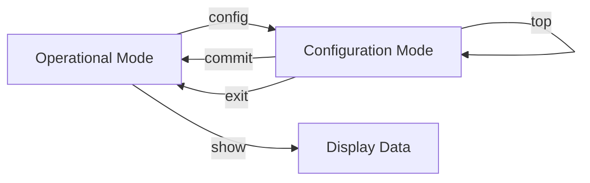
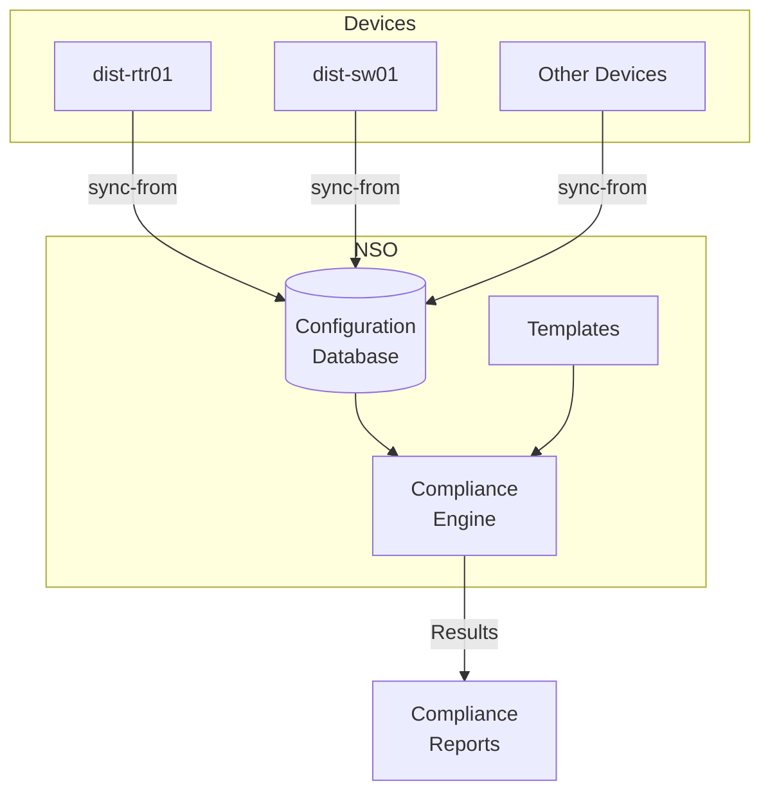

# Getting Started with NSO

**⏱️ Estimated time: 5 minutes**

Now that your lab environment is set up, let's explore Cisco NSO and learn how to navigate its interfaces. NSO provides both a graphical web interface and a powerful command-line interface (CLI).

---

## Learning Objectives

By the end of this section, you will be able to:

- [ ] Navigate the NSO Web UI
- [ ] Use the NSO CLI effectively
- [ ] View and explore device configurations
- [ ] Understand NSO's configuration database (CDB)

---

## NSO Web UI (GUI Interface)

The NSO Web UI provides a user-friendly interface for managing devices, services, and compliance reporting.

### Accessing the Web UI

1. **Open your browser** and navigate to:
   ```
   http://10.10.20.47:8080
   ```

2. **Login with NSO credentials:**
   - Username: `developer`
   - Password: `C1sco12345`

<div class="img-placeholder">
📸 Image Placeholder: NSO Web UI Dashboard
<br><small>Suggested: Screenshot of NSO main dashboard with key areas highlighted</small>
</div>

### Web UI Navigation

The NSO interface is organized into several key areas:

!!! info "Main Navigation Areas"
    **Left Sidebar**
    :   Provides access to Devices, Services, Configuration, and other modules
    
    **Main Content Area**
    :   Displays the selected module's content (device lists, configurations, etc.)
    
    **Top Menu Bar**
    :   Contains Tools, Help, and user account options
    
    **Action Bar**
    :   Context-sensitive actions available for selected items

---

### Exercise 1: Explore Devices in Web UI

Let's explore the managed devices in your NSO instance.

**Step 1:** Click the **Devices** panel in the left sidebar

**Step 2:** Observe the list of managed devices. You should see:
- Device names (dist-rtr01, dist-sw01, etc.)
- Connection status
- Device type (NED)
- Management IP addresses

**Step 3:** Click on the **dist-rtr01** device to select it

**Step 4:** Click the **Config** tab to view the device configuration

**Step 5:** Explore the configuration tree:
- Expand `interface` to see all interfaces
- Expand `router` to see routing protocols
- Navigate through different configuration sections

<div class="img-placeholder">
📸 Image Placeholder: Device Configuration View
<br><small>Suggested: Screenshot showing expanded device configuration tree in NSO</small>
</div>

!!! tip "Configuration Navigation"
    The configuration tree in NSO represents the device's running configuration in a structured format. This is the same data used for compliance checking!

---

### Exercise 2: Sync Devices from Web UI

Synchronizing device configurations is a critical operation before running compliance checks.

**Step 1:** In the **Devices** panel, select all devices by clicking the checkbox in the header row

**Step 2:** Click the **Actions** dropdown menu

**Step 3:** Select **Sync from**

**Step 4:** Click **Run** to execute the sync operation

**Step 5:** Wait for the operation to complete and observe the results

**Expected Result:**
```
sync-from result: true
```

!!! success "Sync Complete"
    All device configurations are now synchronized into NSO's Configuration Database (CDB)

<div class="img-placeholder">
📸 Image Placeholder: Sync-from Operation Results
<br><small>Suggested: Screenshot showing successful sync operation with green checkmarks</small>
</div>

---

## NSO CLI (Command Line Interface)

The NSO CLI provides powerful capabilities for automation, scripting, and advanced operations. It offers two modes: J-style (Juniper-like) and C-style (Cisco-like).

### Accessing the NSO CLI

1. **Open your terminal**

2. **SSH to the NSO instance:**
   ```bash
   ssh developer@10.10.20.47 -p 2024
   ```

3. **Enter the password:** `C1sco12345`

4. **You'll see the J-style prompt:**
   ```
   developer@ncs>
   ```

5. **Switch to Cisco-style CLI:**
   ```
   developer@ncs> switch cli
   ```

6. **Now you have the C-style prompt:**
   ```
   developer@ncs#
   ```

!!! tip "CLI Styles"
    - **J-style (Junos-like):** `developer@ncs>`
    - **C-style (Cisco-like):** `developer@ncs#`
    
    Both provide the same functionality, but commands and syntax differ. This workshop uses C-style.

---

### CLI Navigation Basics

The NSO CLI has several operational modes:



**Common Commands:**

| Command | Description | Example |
|---------|-------------|---------|
| `show` | Display information | `show devices list` |
| `config` | Enter configuration mode | `config` |
| `commit` | Apply configuration changes | `commit` |
| `top` | Return to top level config | `top` |
| `exit` | Exit current mode | `exit` |
| `?` | Context-sensitive help | `show ?` |

---

### Exercise 3: View Devices via CLI

Let's explore device management using the CLI.

**Step 1:** View the list of managed devices:

```bash
developer@ncs# show devices list
```

**Expected Output:**
```
NAME         ADDRESS       PORT  AUTHGROUP  DISPLAY NAME  NED ID
---------------------------------------------------------------------------
dist-rtr01   10.10.20.175  22    default    -             cisco-ios-cli-6.109
dist-sw01    10.10.20.176  22    default    -             cisco-ios-cli-6.109
...
```

**Step 2:** Check a specific device's sync status:

```bash
developer@ncs# devices device dist-rtr01 check-sync
```

**Expected Output:**
```
in-sync: true
```

---

### Exercise 4: Sync Specific Device

**Step 1:** Synchronize the dist-rtr01 device configuration:

```bash
developer@ncs# devices device dist-rtr01 sync-from
```

**Expected Output:**
```
result true
```

!!! info "What Just Happened?"
    NSO connected to dist-rtr01 via SSH, retrieved its running configuration, and stored it in the CDB. This data is now available for compliance checking!

---

### Exercise 5: View Device Configuration

**Step 1:** Display the local copy of the device's running configuration:

```bash
developer@ncs# show running-config devices device dist-rtr01 config
```

**Expected Output:**
```
devices device dist-rtr01
 config
  ios:service password-encryption
  ios:service timestamps debug datetime msec
  ios:service timestamps log datetime msec
  ...
```

!!! tip "Paging Output"
    For long outputs, use `| more` to page through:
    ```bash
    show running-config devices device dist-rtr01 config | more
    ```

**Step 2:** View specific configuration sections:

```bash
# View only interface configuration
developer@ncs# show running-config devices device dist-rtr01 config ios:interface

# View only routing configuration
developer@ncs# show running-config devices device dist-rtr01 config ios:router
```

---

### Exercise 6: Using CLI Completion and Help

The NSO CLI provides extensive tab-completion and context-sensitive help.

**Step 1:** Try tab completion:

```bash
developer@ncs# show dev<TAB>
```

It will complete to:
```bash
developer@ncs# show devices
```

**Step 2:** Use the `?` for help:

```bash
developer@ncs# show devices ?
```

**Output shows available options:**
```
device            Individual device
list              List all devices
device-group      Device groups
...
```

**Step 3:** Get help at any position:

```bash
developer@ncs# show devices device ?
```

**Output shows device names:**
```
<device>          Device name
dist-rtr01
dist-sw01
...
```

!!! success "CLI Mastery Tip"
    Use `<TAB>` liberally for completion and `?` whenever you're unsure of available options!

---

## Understanding NSO's Configuration Database (CDB)

NSO maintains a local copy of all device configurations in its Configuration Database (CDB). Understanding this is crucial for compliance reporting.

### How CDB Works



### Key Concepts

**Sync-from**
:   Retrieves configuration from devices and updates CDB

**Sync-to**
:   Pushes configuration from CDB to devices (used for provisioning)

**Check-sync**
:   Compares CDB with device configuration to detect drift

**CDB Benefits for Compliance:**

1. **No device impact** - Compliance checks read from CDB, not devices
2. **Fast execution** - No network latency, instant checks
3. **Point-in-time consistency** - All devices checked against same snapshot
4. **Offline capability** - Can run reports even if devices are unreachable

!!! warning "Keep CDB Updated"
    Always sync devices before running compliance reports to ensure you're checking current configurations!

---

## Optional: Advanced CLI Features

### Configuration Mode

Enter configuration mode to make changes:

```bash
developer@ncs# config
developer@ncs(config)#
```

### Show Configuration Differences

```bash
developer@ncs(config)# show configuration
```

### Rollback Changes

```bash
developer@ncs(config)# rollback configuration
```

### Exit Configuration Mode

```bash
developer@ncs(config)# exit
developer@ncs#
```

---

## Practice Exercise

Before moving to the next section, practice these tasks:

!!! example "Practice Tasks"
    1. ✏️ Log into both NSO Web UI and CLI
    2. ✏️ View the list of devices in both interfaces
    3. ✏️ Sync all devices from CDB
    4. ✏️ View the configuration of dist-rtr01 in both interfaces
    5. ✏️ Check the sync status of a device
    6. ✏️ Use tab-completion and `?` help in the CLI

---

## Summary

You've learned how to:

- ✅ Navigate the NSO Web UI
- ✅ Use the NSO CLI effectively
- ✅ View and synchronize device configurations
- ✅ Understand NSO's Configuration Database (CDB)
- ✅ Use CLI help and tab-completion

---

## Next Steps

Now that you're comfortable with NSO's interfaces, you're ready to start building compliance templates!

[Continue to Building Compliance Templates →](compliance-templates.md){ .md-button .md-button--primary }
[Back to Setup →](setup.md){ .md-button }
