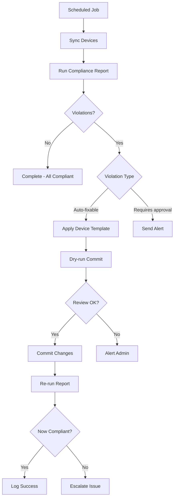

# Remediation

**⏱️ Estimated time: 7 minutes**

Once you've identified compliance violations through reports, the next step is remediation - fixing the non-compliant configurations. NSO provides powerful tools to automate this process using **device templates**.

---

## Understanding Device Templates

While **compliance templates** check configuration, **device templates** push configuration to devices.


### Key Differences

| Compliance Templates | Device Templates |
|---------------------|------------------|
| **Check** configuration | **Push** configuration |
| Read-only operation | Write operation |
| Generate reports | Change devices |
| Identify violations | Fix violations |

---

## Creating a Device Template

Let's create a device template to remediate the NO-HTTP compliance violation.

### Example: NO-HTTP Device Template

**Compliance Requirement:** HTTP and HTTPS servers should be disabled

**Device Template Configuration:**

**Step 1:** Enter configuration mode:
```bash
developer@ncs# config
```

**Step 2:** Load the device template:
```bash
developer@ncs(config)# load merge terminal
```

**Step 3:** Paste the XML:
```xml
<devices xmlns="http://tail-f.com/ns/ncs">
    <template>
        <name>NO-HTTP</name>
        <ned-id>
        <id xmlns:cisco-ios-cli-6.109="http://tail-f.com/ns/ned-id/cisco-ios-cli-6.109">cisco-ios-cli-6.109:cisco-ios-cli-6.109</id>
        <config>
            <ip xmlns="urn:ios">
            <http>
                <server>false</server>
                <secure-server>false</secure-server>
            </http>
            </ip>
        </config>
        </ned-id>
    </template>
</devices>
```

**Step 4:** Press `Ctrl+D`, then commit:
```bash
developer@ncs(config)# show configuration
developer@ncs(config)# commit
developer@ncs(config)# exit
```

!!! success "Device Template Created"
    The template will configure `no ip http server` and `no ip http secure-server`

---

## Applying Device Templates

Device templates can be applied to individual devices or device groups.

### Method 1: Apply via CLI

**Step 1:** Enter configuration mode:
```bash
developer@ncs# config
```

**Step 2:** Navigate to the device:
```bash
developer@ncs(config)# devices device dist-rtr01
```

**Step 3:** Apply the template:
```bash
developer@ncs(config-device-dist-rtr01)# apply-template template-name NO-HTTP
```

**Step 4:** Preview the changes:
```bash
developer@ncs(config-device-dist-rtr01)# top
developer@ncs(config)# show configuration
```

**Expected Output:**
```
devices device dist-rtr01
 config
  ip http server false
  ip http secure-server false
```

**Step 5:** Commit the changes (with dry-run first):
```bash
developer@ncs(config)# commit dry-run outformat native
```

This shows the exact CLI commands that will be sent to the device:
```
device dist-rtr01
 no ip http server
 no ip http secure-server
```

**Step 6:** Commit for real:
```bash
developer@ncs(config)# commit
```

!!! tip "NSO FastMap"
    NSO's FastMap feature ensures that only **new or changed** configuration is sent to devices. If the configuration already exists, nothing is sent!

---

### Method 2: Apply via Web UI

**Step 1:** Navigate to **Configuration** → **Devices** → **device** → **dist-rtr01**

**Step 2:** Right-click on the device and select **Apply Template**

**Step 3:** Choose **NO-HTTP** from the template list

**Step 4:** Click **Apply**

**Step 5:** Review the configuration changes

**Step 6:** Click **Commit** to apply

<div class="img-placeholder">
📸 Image Placeholder: Applying Device Template
<br><small>Suggested: Screenshot showing device template application in NSO Web UI</small>
</div>

---

## Loading All Remediation Templates

For this workshop, multiple device templates have been pre-created. Let's load them all at once.

**Step 1:** Enter configuration mode:
```bash
developer@ncs# config
```

**Step 2:** Load all device templates from file:
```bash
developer@ncs(config)# load merge resources/devnet_sandbox/devwks_templates/all-device-templates.xml
```

**Step 3:** Commit:
```bash
developer@ncs(config)# commit
developer@ncs(config)# exit
```

**Step 4:** Verify templates were created:
```bash
developer@ncs# show running-config devices template
```

---

## Complete Remediation Workflow

Let's remediate all violations found in our compliance report.

### Step 1: Review Current Violations

Run the compliance report to see current status:

```bash
developer@ncs# compliance reports report DevNet-2025 run run-name pre-remediation
developer@ncs# show compliance reports report DevNet-2025 run pre-remediation result
```

Document which templates show violations.

---

### Step 2: Apply Remediation Templates

Apply templates for each violation, one at a time or all together:

```bash
developer@ncs# config
developer@ncs(config)# devices device dist-rtr01

# Apply individual templates
developer@ncs(config-device-dist-rtr01)# apply-template template-name LOGIN-POLICY
developer@ncs(config-device-dist-rtr01)# apply-template template-name NO-HTTP
developer@ncs(config-device-dist-rtr01)# apply-template template-name NO-AUX
developer@ncs(config-device-dist-rtr01)# apply-template template-name ENABLE-SECRET
developer@ncs(config-device-dist-rtr01)# apply-template template-name NO-ENABLE-PASSWORD

# Templates with variables
developer@ncs(config-device-dist-rtr01)# apply-template template-name LOOPBACK0 variable { name LOOPBACK0_IP value '10.0.100.10' }
developer@ncs(config-device-dist-rtr01)# apply-template template-name ROUTER-ID variable { name LOOPBACK0_IP value '10.0.100.10' }

developer@ncs(config-device-dist-rtr01)# top
```

---

### Step 3: Preview Changes

Always preview changes before committing:

```bash
developer@ncs(config)# show configuration
```

Review the configuration that will be applied.

---

### Step 4: Dry-Run Commit

See the exact native CLI commands that will be sent:

```bash
developer@ncs(config)# commit dry-run outformat native
```

**Example Output:**
```
device dist-rtr01
 login on-failure log
 login on-success log
 no ip http server
 no ip http secure-server
 interface Loopback0
  ip address 10.0.100.10 255.255.255.255
 !
 router ospf 1
  router-id 10.0.100.10
 !
 line aux 0
  no exec
  transport output none
 !
```

!!! tip "Always Dry-Run First"
    The dry-run shows you **exactly** what will happen without making any changes. Use it to verify before committing!

---

### Step 5: Commit Changes

If the dry-run looks good, commit for real:

```bash
developer@ncs(config)# commit
developer@ncs(config)# exit
```

NSO will connect to the device and apply all changes.

**Expected Output:**
```
Commit complete.
```

<div class="img-placeholder">
📸 Image Placeholder: Successful Remediation Commit
<br><small>Suggested: Screenshot showing successful commit with configuration push to device</small>
</div>

---

### Step 6: Verify Remediation

Run the compliance report again to verify all violations are resolved:

```bash
developer@ncs# compliance reports report DevNet-2025 run run-name post-remediation
```

**Step 7:** View results:

```bash
developer@ncs# show compliance reports report DevNet-2025 run post-remediation result
```

**Expected Output:**
```
DEVICE      RESULT      TEMPLATES
--------------------------------------
dist-rtr01  compliant   All templates passed
```

!!! success "Remediation Complete!"
    All compliance violations should now be resolved!

---

## Comparing Before and After

Compare the two report runs to see what changed:

```bash
developer@ncs# show compliance reports report DevNet-2025 run pre-remediation compare post-remediation
```

This provides a clear view of the remediation impact.

---

## Advanced Remediation Techniques

### Using Device Groups

Apply templates to multiple devices at once:

```bash
developer@ncs# config
developer@ncs(config)# devices device-group ALL-ROUTERS apply-template template-name NO-HTTP
developer@ncs(config)# commit
```

### Conditional Templates

Use variables and conditionals for environment-specific remediation:

```xml
<variable>
    <name>ENVIRONMENT</name>
    <value>PRODUCTION</value>
</variable>
```

### Rollback on Failure

If a commit fails, NSO automatically rolls back:

```bash
developer@ncs(config)# commit
% Configuration error: device dist-rtr01: connection refused
Aborting: commit failed
```

The device remains unchanged.

---

## Best Practices for Remediation

!!! tip "Remediation Best Practices"
    1. **Always run compliance reports first** - Know what needs fixing
    2. **Use dry-run commits** - Preview changes before applying
    3. **Remediate incrementally** - Fix one issue at a time for large changes
    4. **Document changes** - Save commit messages and dry-run outputs
    5. **Verify after remediation** - Re-run compliance reports
    6. **Have a rollback plan** - Know how to revert changes if needed

!!! warning "Common Mistakes"
    - Committing without dry-run review
    - Applying templates to wrong devices
    - Not syncing devices before checking compliance
    - Forgetting to provide required template variables
    - Not verifying remediation was successful

---

## Rollback and Recovery

If remediation causes issues, NSO provides rollback capabilities.

### View Rollback Files

```bash
developer@ncs# show rollback
```

**Output:**
```
ROLLBACK  DATE                  USER        LABEL
0         2025-01-20 10:30:15   developer   
1         2025-01-20 09:15:42   developer   
2         2025-01-20 08:45:11   developer   
```

### Apply a Rollback

```bash
developer@ncs# config
developer@ncs(config)# rollback configuration 10001
developer@ncs(config)# commit
```

This reverts to a previous configuration state.

---

## Automated Remediation Workflow

For production environments, consider automating the remediation workflow:



---

## Practice Exercise

Before moving to advanced topics, practice remediation:

!!! example "Practice Tasks"
    1. ✏️ Create a new device template for a compliance check
    2. ✏️ Apply the template to dist-rtr01
    3. ✏️ Use dry-run to preview the changes
    4. ✏️ Commit the configuration
    5. ✏️ Run a compliance report to verify the fix
    6. ✏️ Compare before and after report results

---

## Summary

You've learned how to:

- ✅ Create device templates for remediation
- ✅ Apply templates to devices via CLI and Web UI
- ✅ Use dry-run commits to preview changes
- ✅ Execute complete remediation workflows
- ✅ Verify remediation with compliance reports
- ✅ Compare before/after results
- ✅ Use rollback for recovery

---

## Next Steps

You've completed the core compliance reporting workflow! The next section covers advanced topics including compliance services for continuous monitoring.

[Continue to Advanced Topics →](advanced.md){ .md-button .md-button--primary }
[Back to Compliance Reports →](compliance-reports.md){ .md-button }
