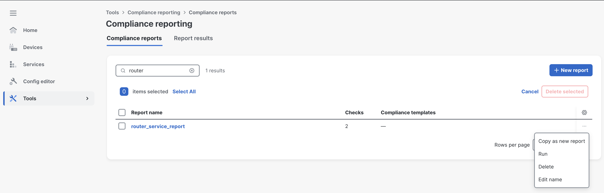
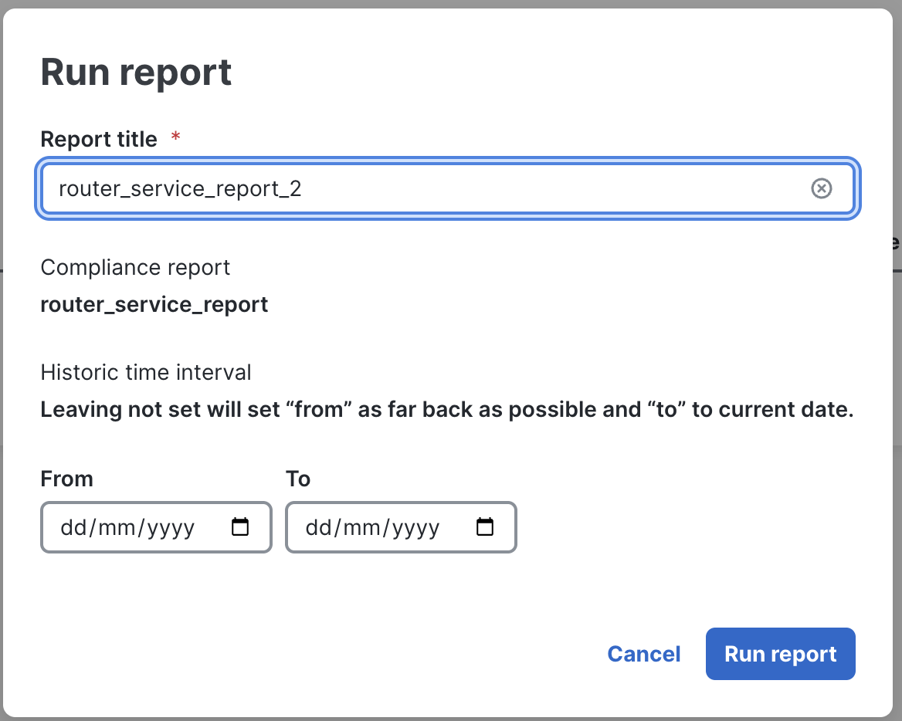
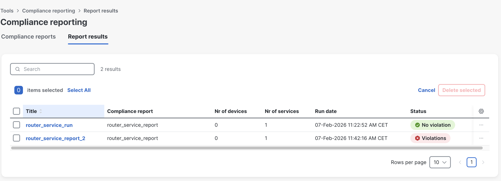
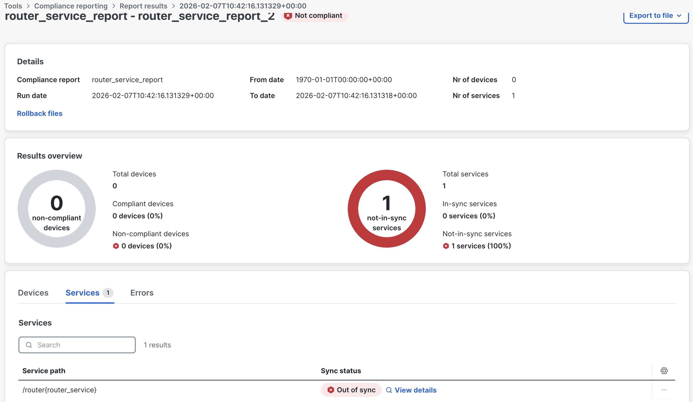
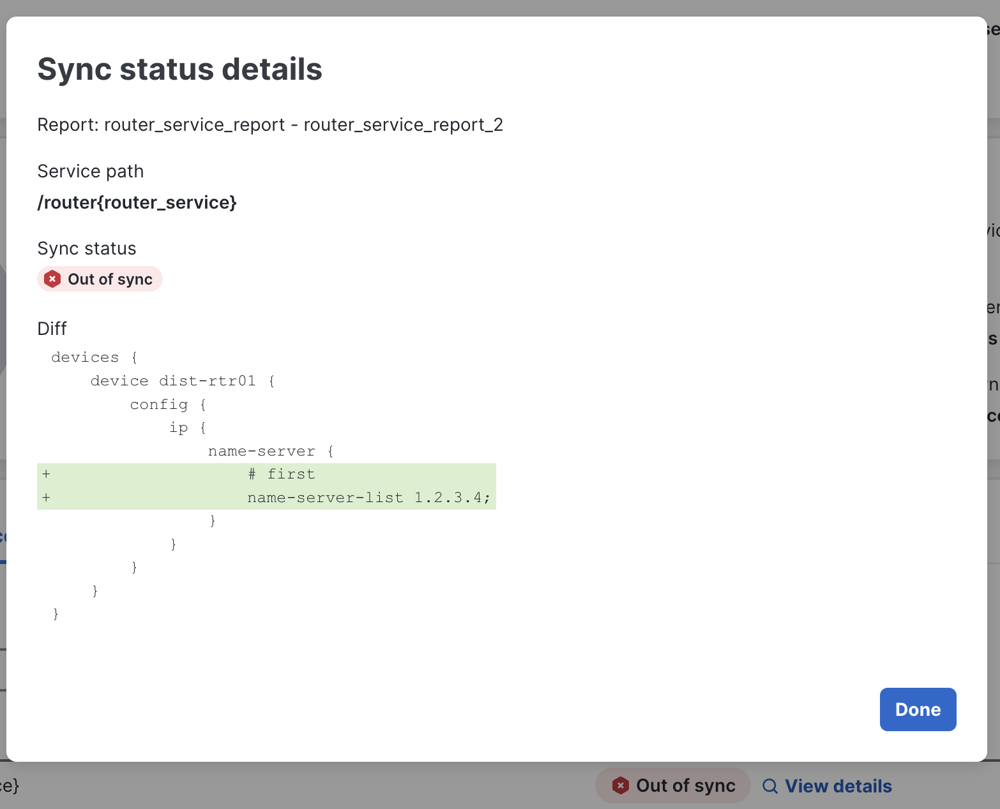
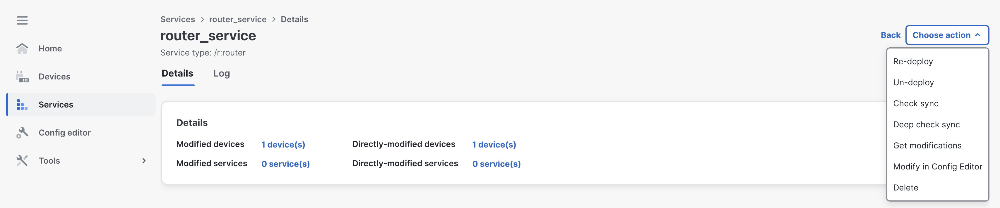
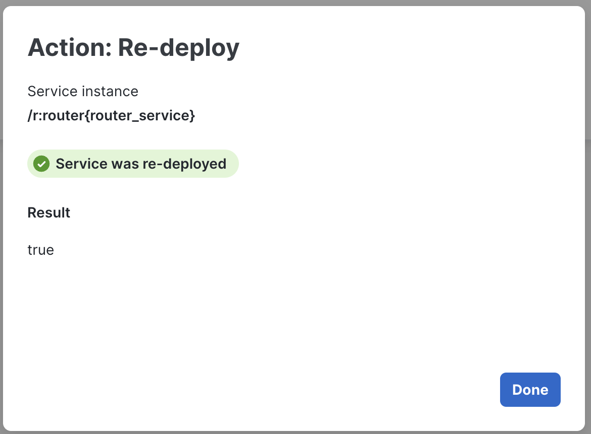
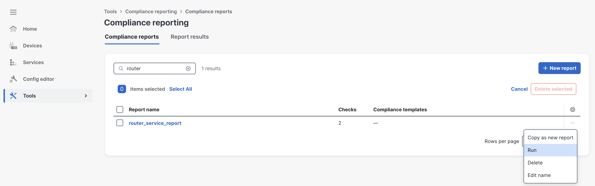
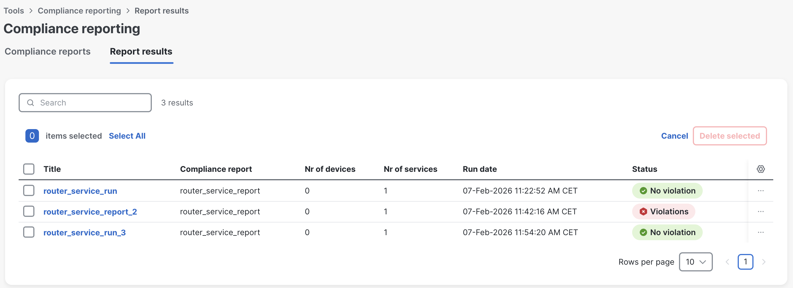
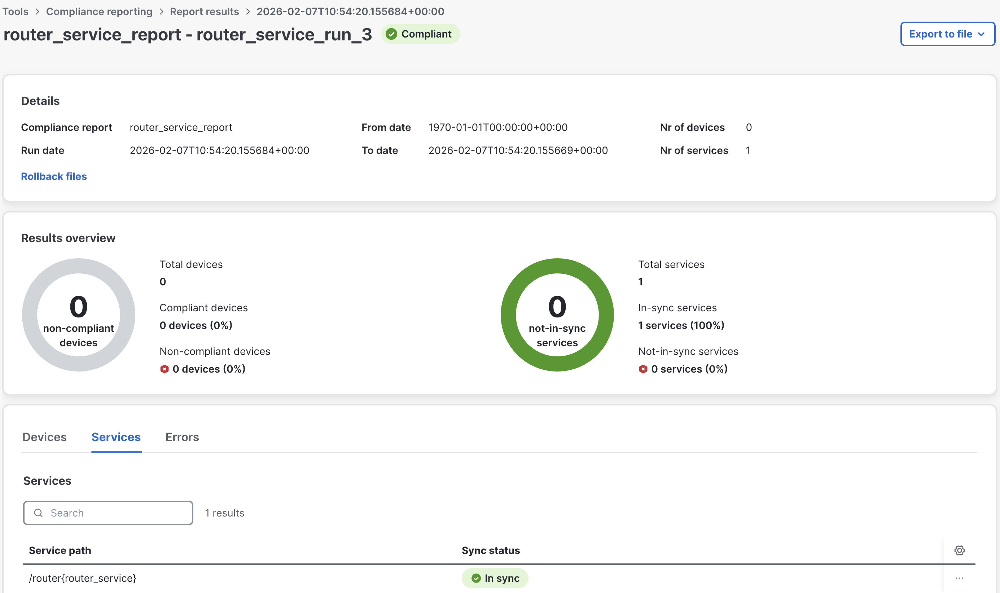

This task demonstrates how easily non-compliant services can be remediated. You will re-run the compliance report, observe the failure, and remediate by re-deploying the service.

Go to **Tools** -> **Compliance Reports** and click the **...** menu (right side) to re-run the report. Click **Run**.

Name it **router_service_report_2** and click **Run report**.

The report now shows **Violations**.

Opening the report reveals why it is not compliant — the service is out-of-sync because the configuration was deleted manually.

Click **View details** to see exactly what is missing for the service to be in sync.

> The key difference with service-based compliance: remediation is much faster and simpler — you just re-deploy the service. The trade-off is that compliance checks are limited to what the service defines.

To remediate, navigate to **Services** (left menu), open the **router_service** instance, click **Choose action**, then **Re-deploy**.

> This action automatically pushes the missing configuration to the devices so the service is back in sync.

Click **Done**.

Navigate back to **Compliance Reports** and run it one final time.

Name it **router_service_run_3** and click **Run report**.

You are now fully **Compliant**.

Thank you for completing the workshop! This guide can be revisited anytime using the [DevNet Sandbox](https://devnetsandbox.cisco.com/DevNet) — search for **Network Services Orchestrator 6.4.4**.

  Built with love by Cisco CX Automation Team | Cisco Live 2026

