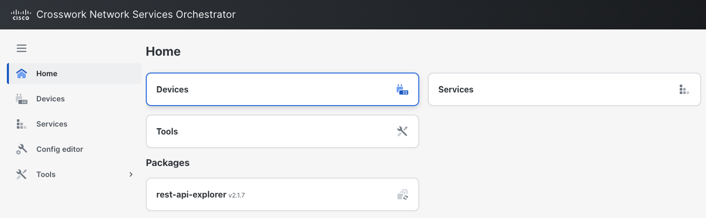
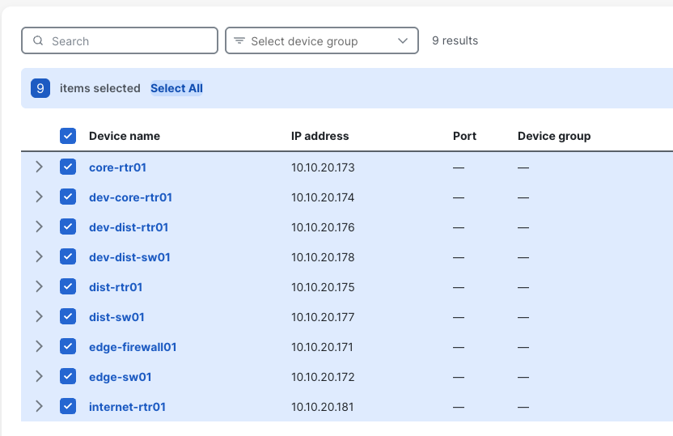
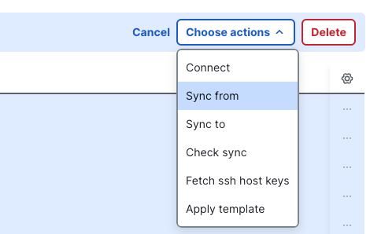

Before performing an audit, NSO must have the latest configuration from the network (the "Source of Truth"). In this task you will execute the **sync-from** action, which pulls the configurations from the devices and saves them in the Configuration Database (CDB).

### Steps

Navigate to the **Devices** list in the main menu.

**Select all** devices.

Click the **Choose actions** dropdown and select **Sync From**. This pulls the device configurations into the NSO CDB (Configuration Database).

Once the sync is complete, click **Done**.
