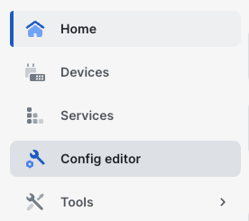
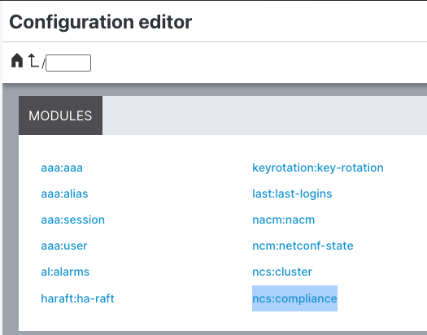
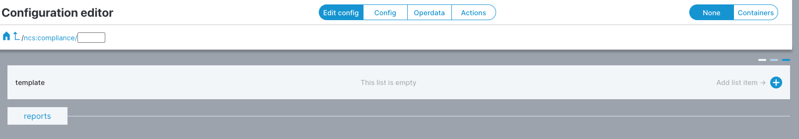
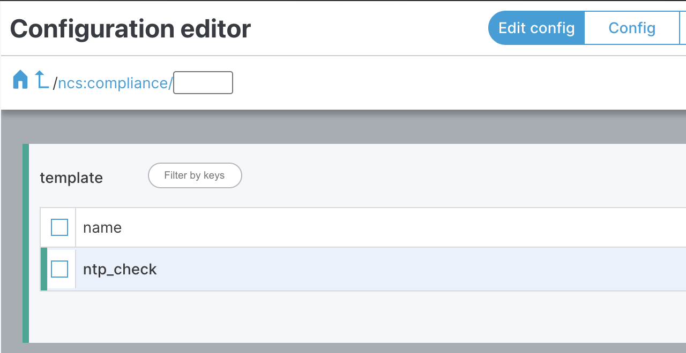
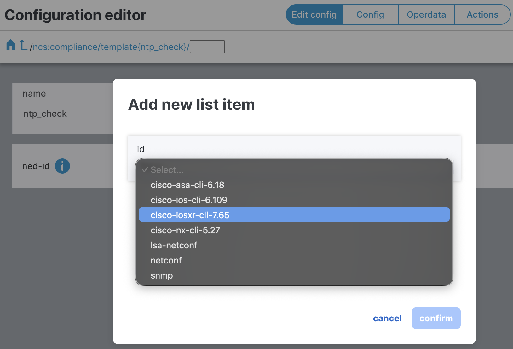
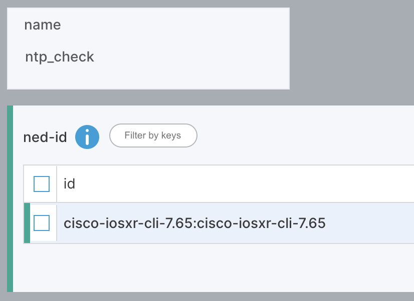
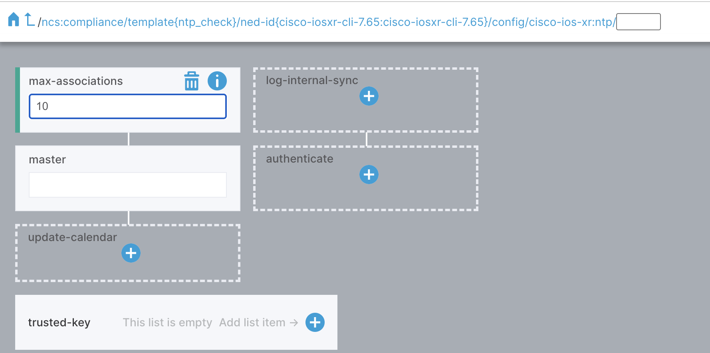
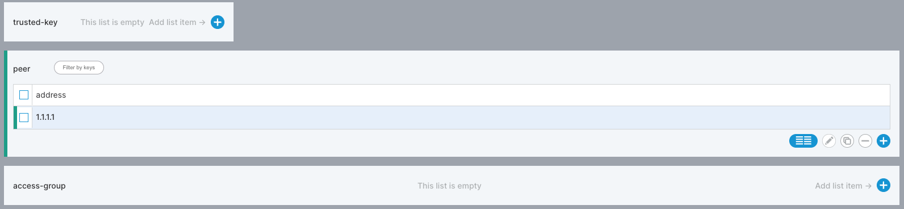
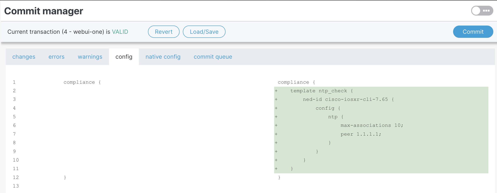
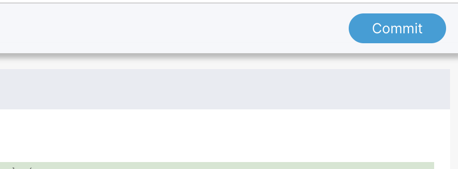

In this task you will create a Compliance Template that defines the intended state of your network. NSO will later compare the live device configuration against this template to identify deviations.

Open the **Configuration Editor**.

Select the **ncs:compliance** module.

Click **Edit Config** (top bar), then click the **+** button.

Name the template **ntp_check**.

> **Candidate Config:** Green bars indicate changes are staged as a "candidate" configuration. They are not active until you click **Commit**.

Click on the **ntp_check** template and click the **+** button next to the template name.

> **NED (Network Element Driver):** Creates the Device Abstraction Layer in NSO, translating user intent to device-specific syntax (e.g. ASA, IOS, IOS-XR, NX-OS).

Select the NED **cisco-iosxr-cli-7.65** and click **Confirm**.

Click **config**, then **ntp** to navigate to the NTP path:

`ncs:compliance/template{ntp_check}/ned-id{cisco-iosxr-cli-7.65}/config/cisco-ios-xr:ntp/`

Configure the following:

**Max Associations:** 10

**Peer Address:** 1.1.1.1

Click the **Launchpad** icon (top right) to review your changes.

Click the **Config** tab to verify the staged configuration.

The green highlights show the configuration being checked.

Click **Commit**, then **Yes, commit**.

> **Note:** To check other device types, repeat this process by adding a different NED.
