Now you will compare the current network state against the **ntp_check** template to determine whether devices are compliant or require remediation.

Go to **Tools** -> **Compliance Reports**.

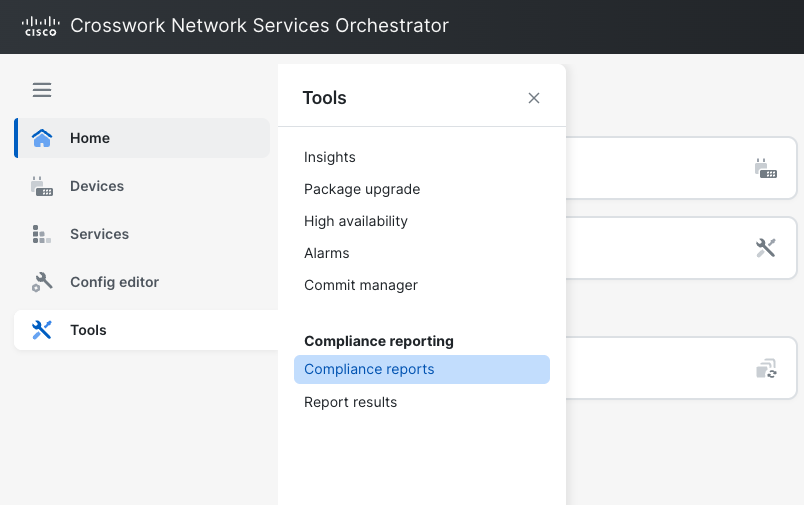

Click **+ New report**.

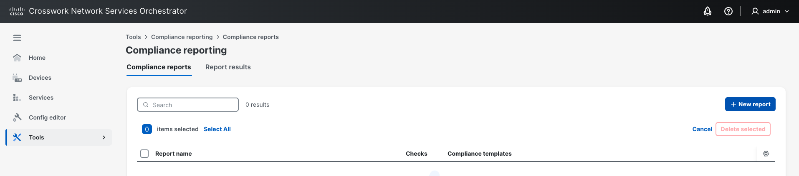

Name it **ntp_report** and click **Create**.

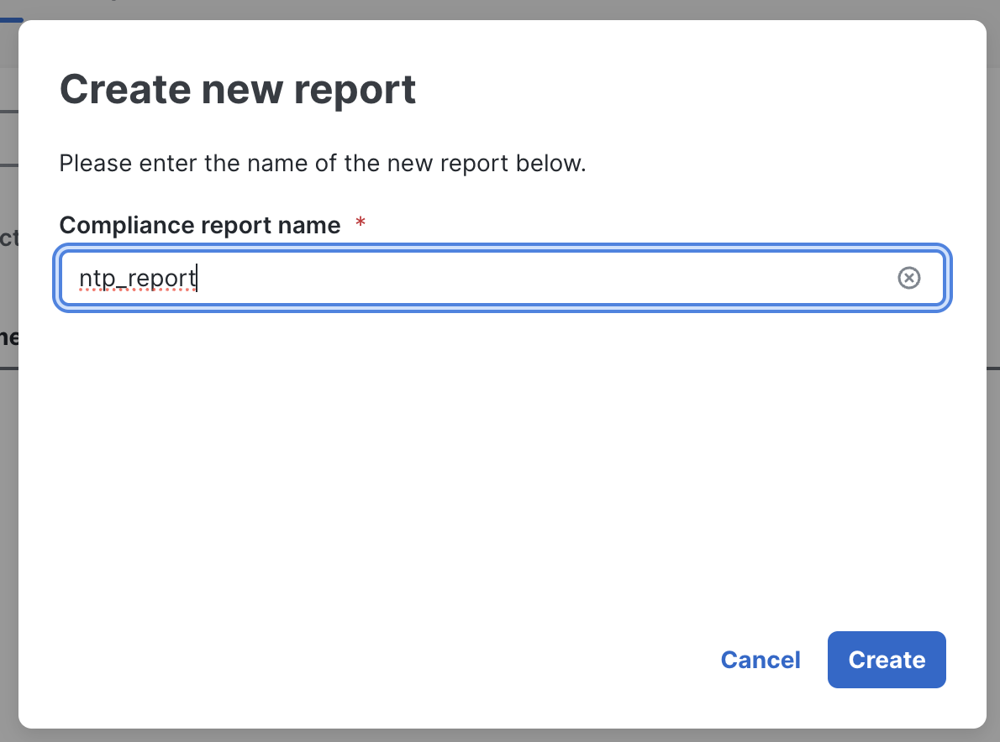

In the **Devices** tab, select **All devices**.

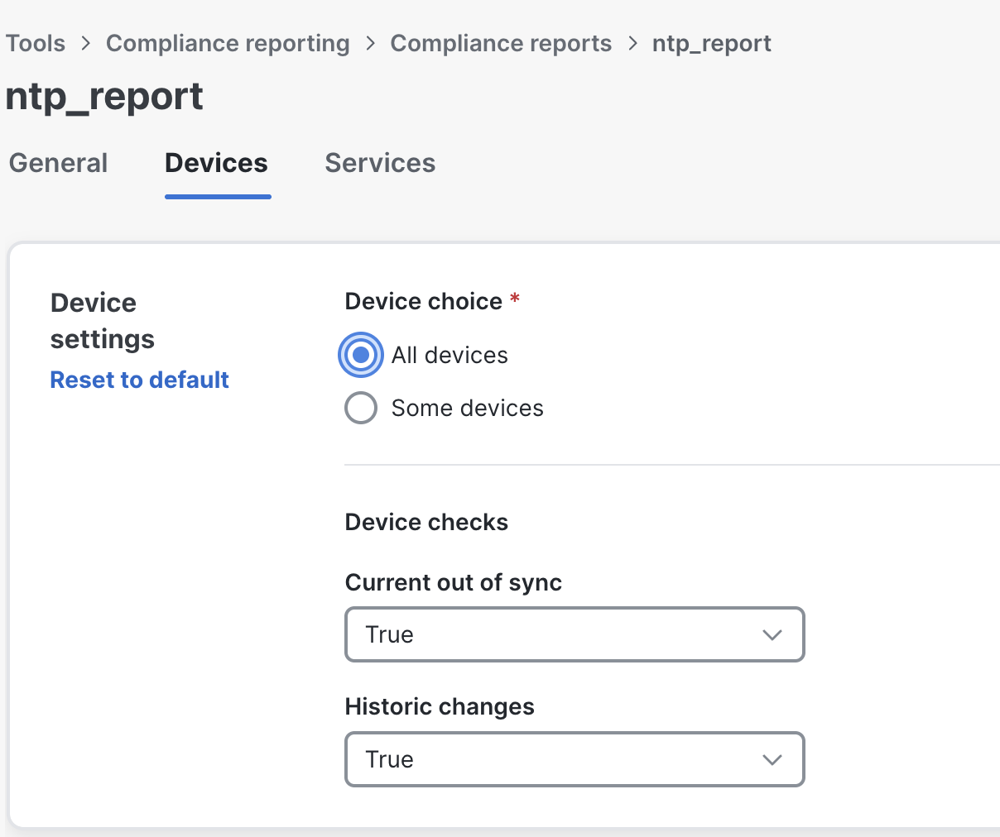

Scroll to **Compliances** and click **Add Template**.

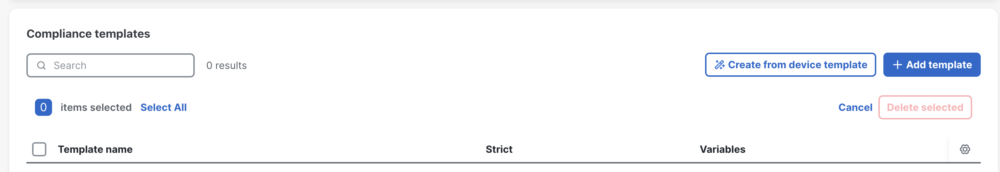

Select the **ntp_check** template you created earlier.

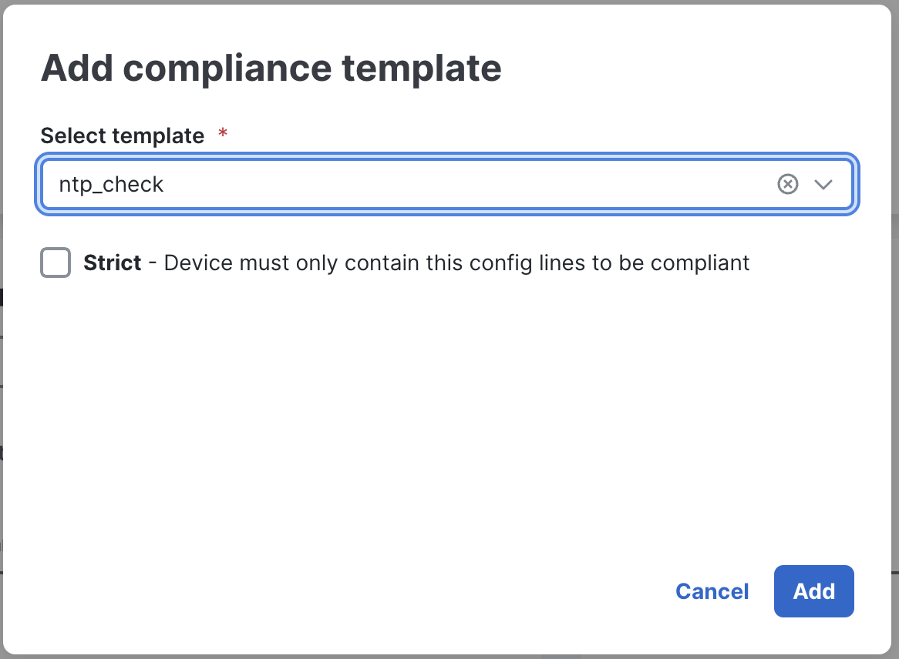

Scroll up and click **Create Report**. Verify the report name and template are listed correctly.

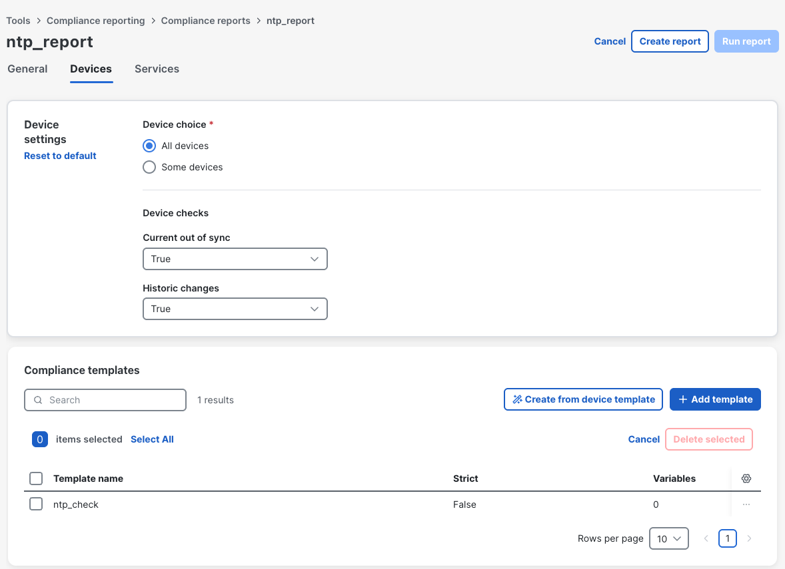

Your report is ready to run. Click **Save Report**.

Name the run **ntp_run** and click **Run report**.

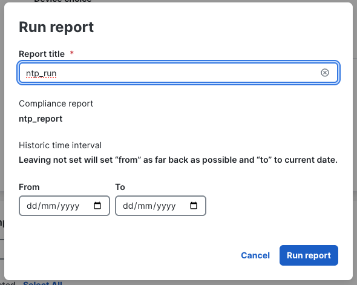

Click the **Report results** link in the pop-up, or find it under **Tools -> Report results**.

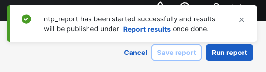

You can see there are some violations. Click on the report execution **ntp_run** to see the details.

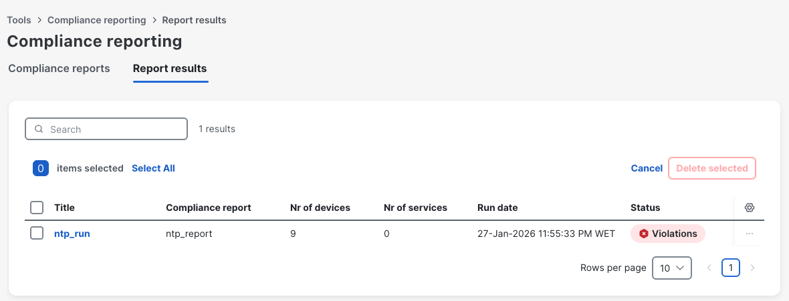

The result shows your network of 9 devices is 78% compliant — only 2 devices are not compliant.

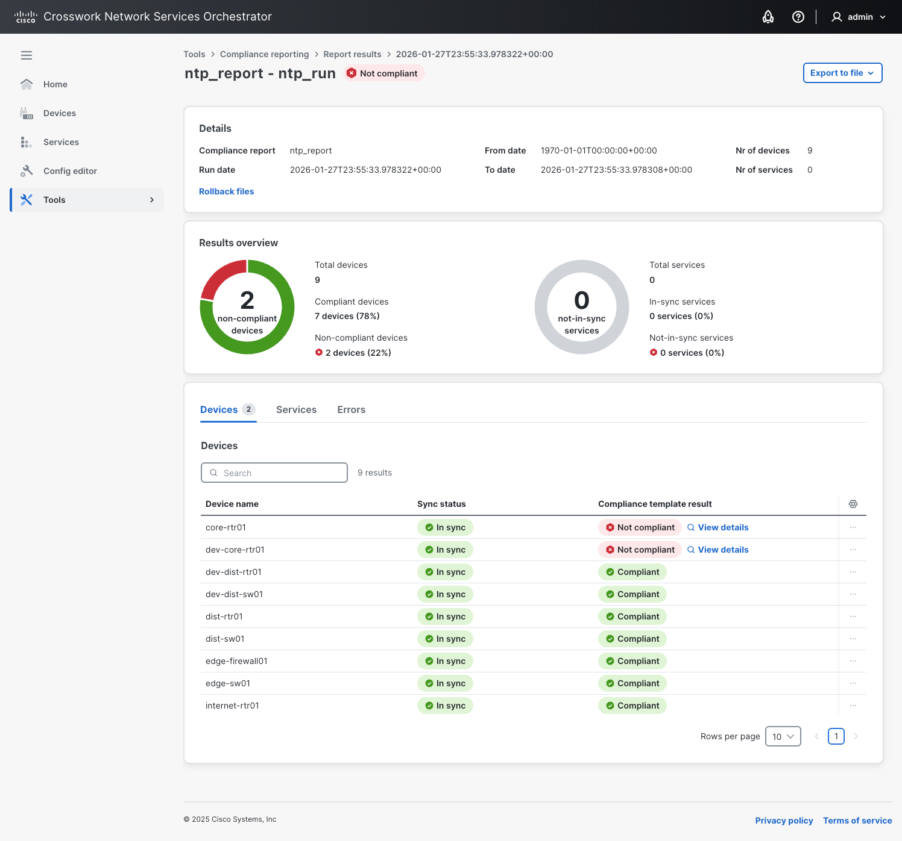

Click **View details** on a non-compliant device to see exactly what configuration is missing.

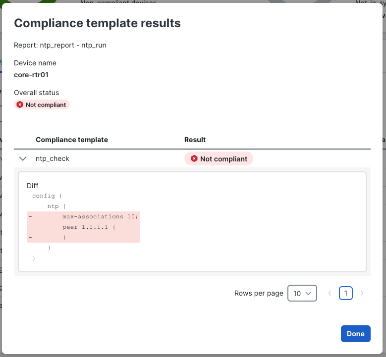

> There are two ways to remediate:
>
> 1. If you are testing against an **NSO Service**, you can click the **Re-Deploy** action and devices will automatically become compliant.
>
> 2. Since you are testing against a **Compliance Template**, you will create a Device Template and apply it to the devices.
>
> There is always a third option — inserting configurations manually — but the automation path is far more scalable, especially when a compliance check reveals missing configurations across many devices.
