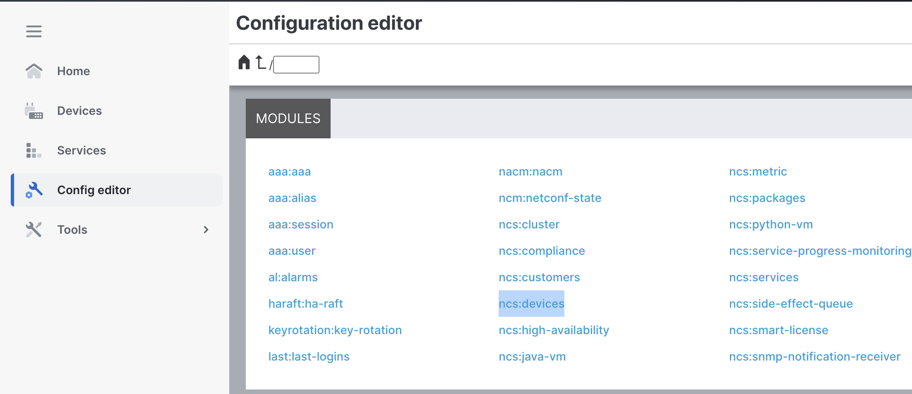
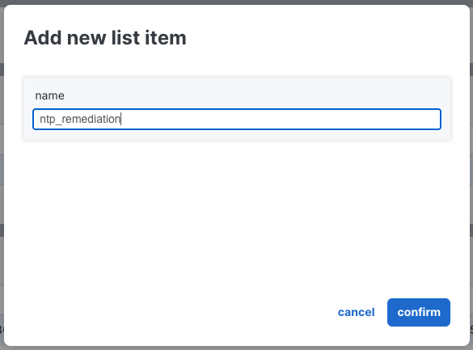
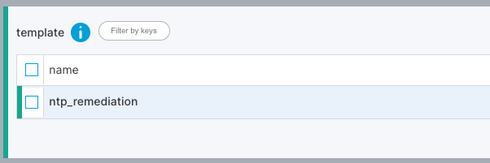
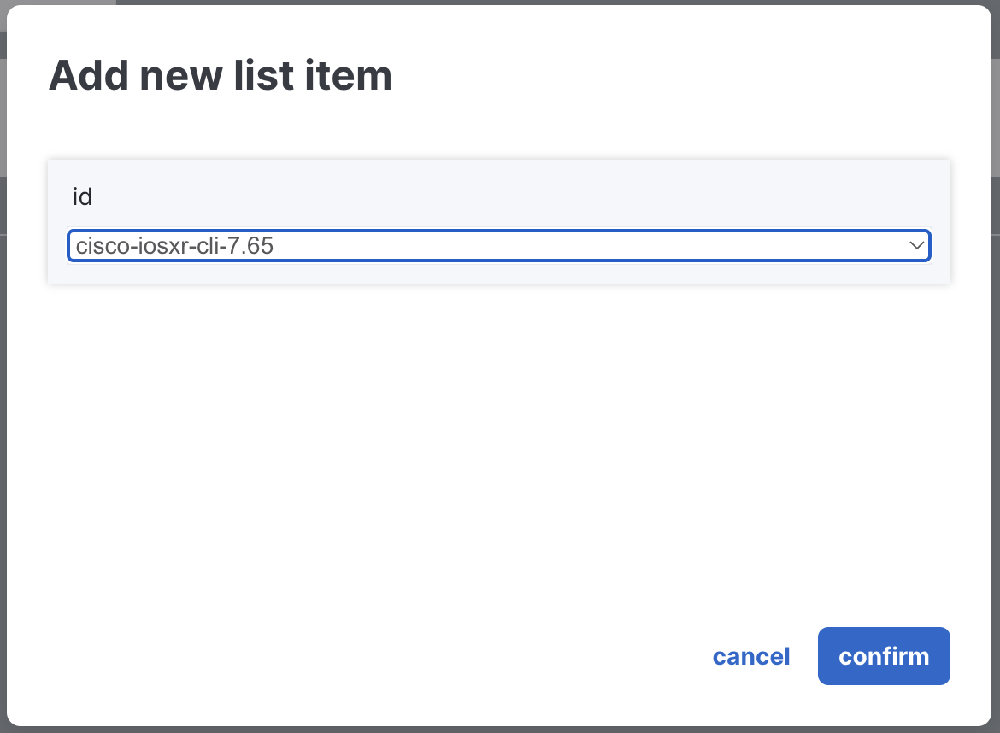
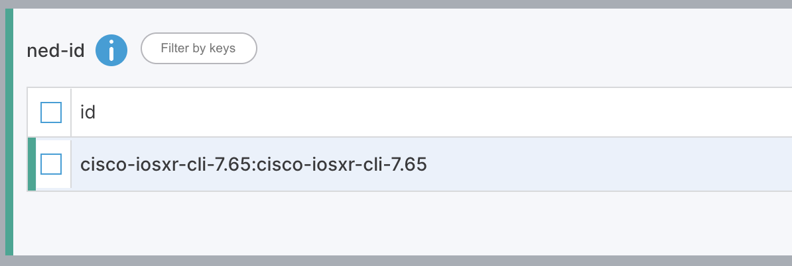
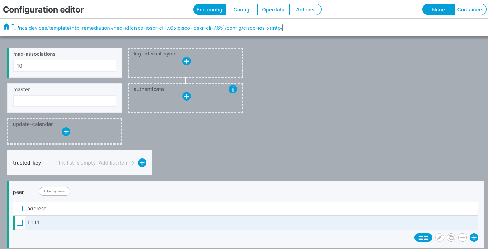
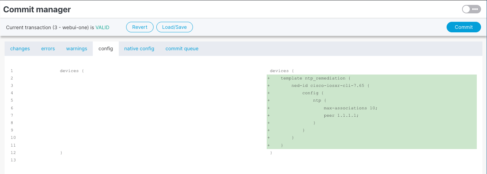

Since the compliance report revealed non-compliant devices, you need a device template to push the missing configuration. In this task you will create a device template with the correct NTP settings and prepare it for deployment.

Double-click **Config Editor** in the left menu.

Select the **ncs:devices** module.

Click **Edit Config**.

Click **Template**, then the **+** button.

Name it **ntp_remediation** and click **Confirm**.

Click on the **ntp_remediation** template.

Select the **cisco-iosxr-cli-7.65** NED.

Click on the ned-id **cisco-iosxr-cli-7.65:cisco-iosxr-cli-7.65**, then click **config**.

Set the NTP values: **Max-associations** (10) and **Peer Address** (1.1.1.1).

Click the **Launchpad** icon (top right) to review your changes.

Confirm the changes and click **Commit**, then **Yes, commit**.

