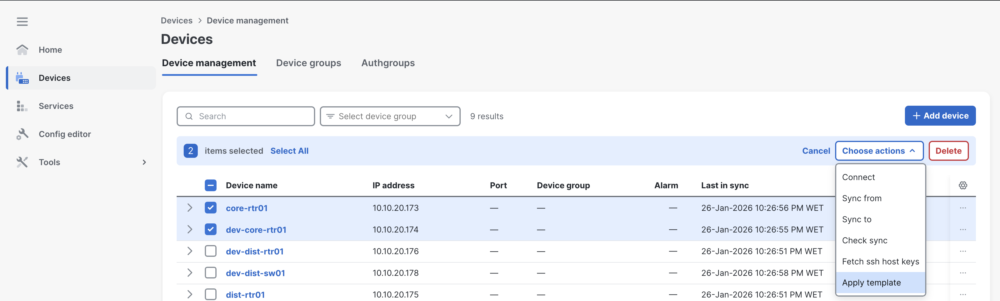
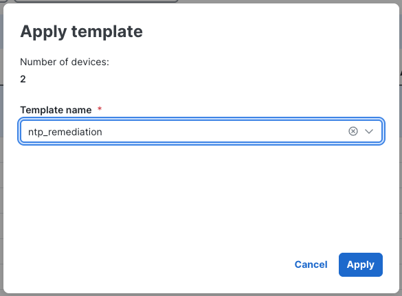
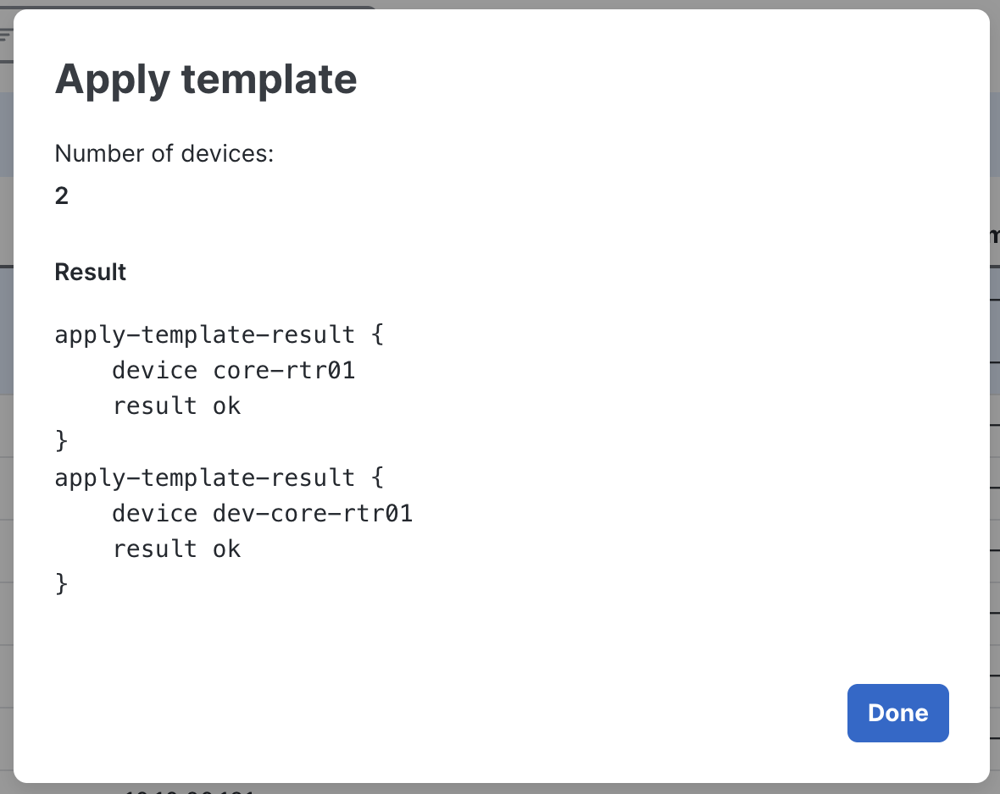
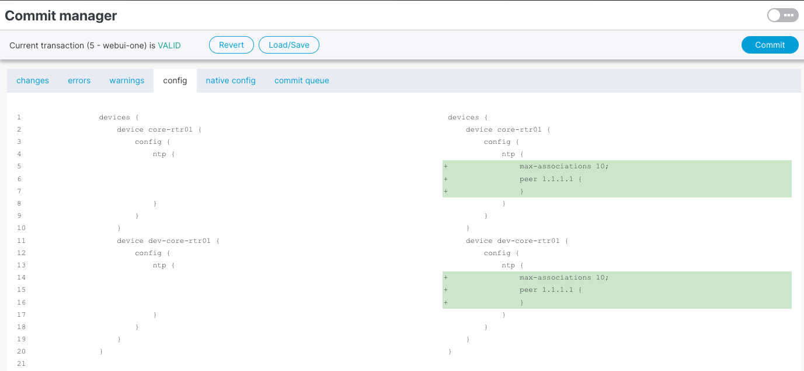
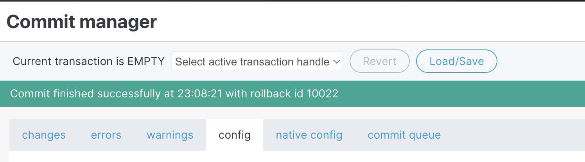

You are now applying the remediation template to the non-compliant devices.

Navigate to the **Devices** menu. Select the devices you want to apply the template to, then click **Choose actions** and select **Apply template**.

Select the template and click **Apply**.

You should see a **result ok** message. Click **Done**.

Check the **Launchpad** (top right) — you should see 6 changes pending.

NSO will automatically apply the changes from the template to the devices.

> NSO is smart and will only apply the needed changes. For example, if a device already had "max-associations" configured, NSO would skip those lines from the template for that device.

Click **Commit**, then **Yes, commit**. You should see the message "Commit finished...rollback id..."

This is another great advantage of NSO — every change can be reverted easily.

