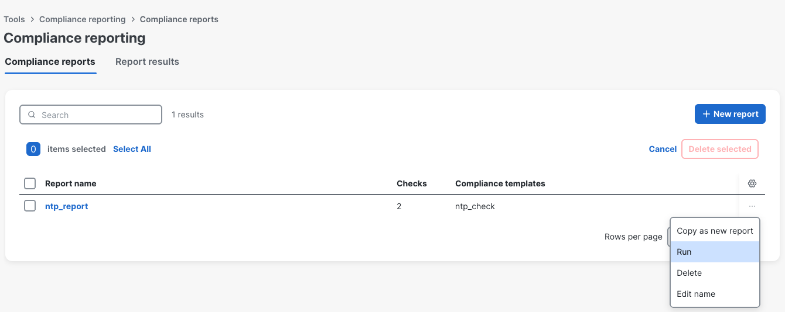
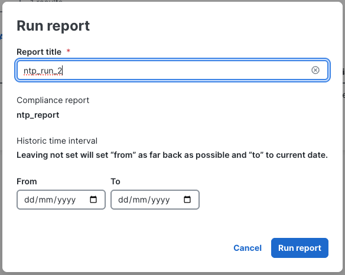
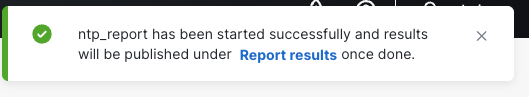
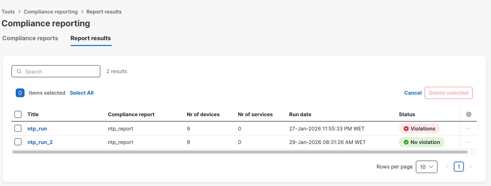
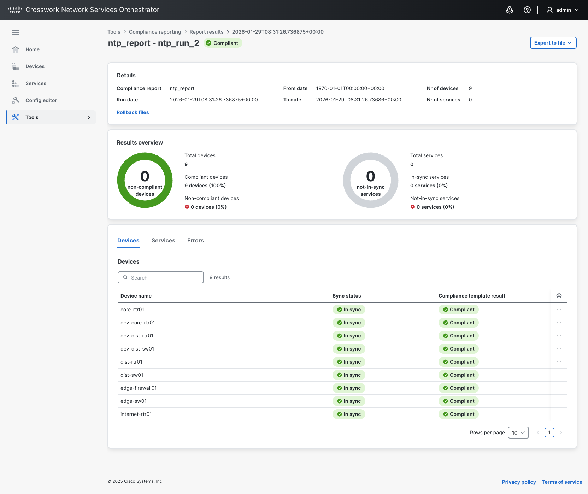

You will now re-run the compliance report to verify the impact of your remediation and confirm full compliance.

Go to **Tools** -> **Compliance reports**. Click the **...** menu on the right side of the report row and select **Run**.

Name it **ntp_run_2** and click **Run report**.

Navigate to **Report Results**.

The report now shows **No violation**, which means all devices are compliant.

Opening the report confirms you are **fully compliant**.

> There is also the option to export reports to **PDF** format for internal documentation and auditing purposes.

Congratulations! You have successfully completed the compliance workshop.
