To automate configuration deployment in NSO, you develop a service. These services can also support compliance activities. In this task you will deploy a pre-built service to a device.

### Deploy the Service

In the left menu, click **Services** and select the **r:router** pre-built service.

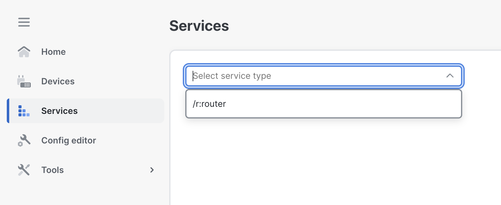

Click **+ Add service** on the right side.

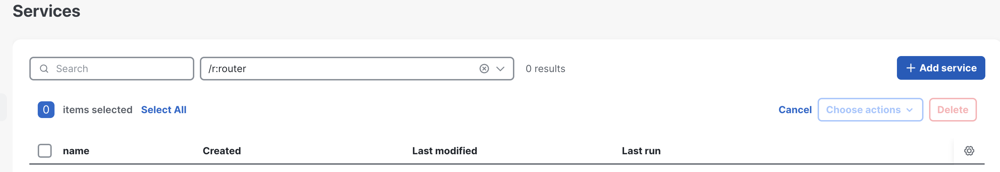

Click the **+** button to add a new entry to the list.

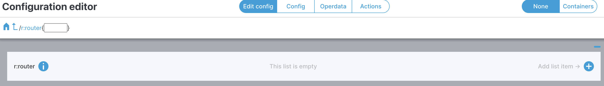

Name it **router_service** and click **Confirm**.

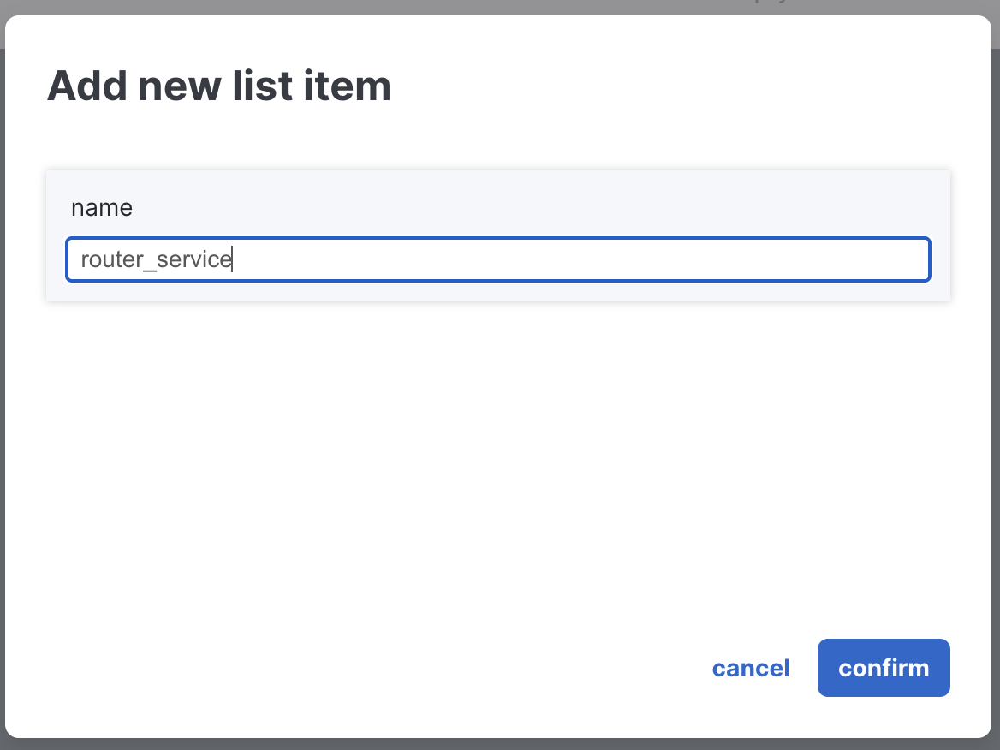

Click on the **router_service** instance you just created.

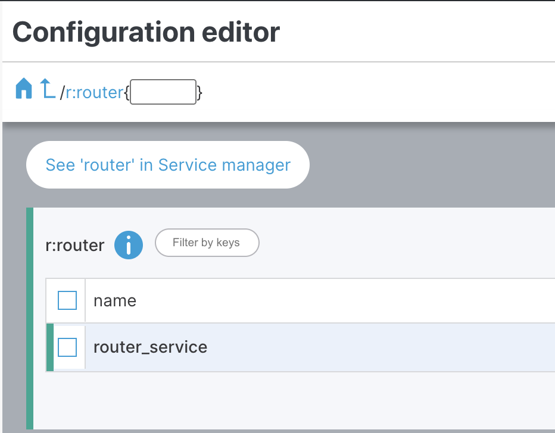

Click the **+** button to select the devices that will use this service.

Select **dist-rtr01** and click **Confirm**.

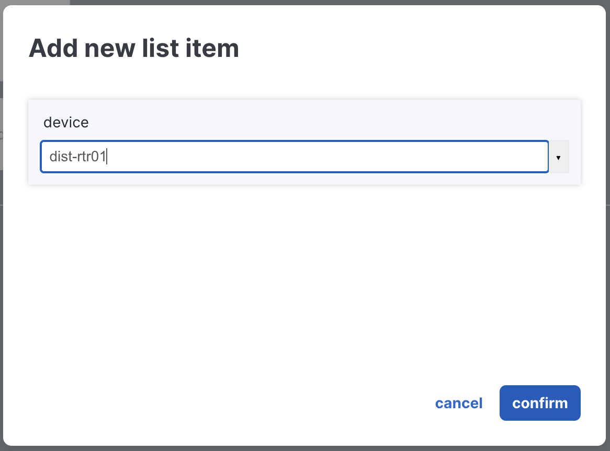

> To apply the same configuration to additional devices, repeat the process and select more devices.

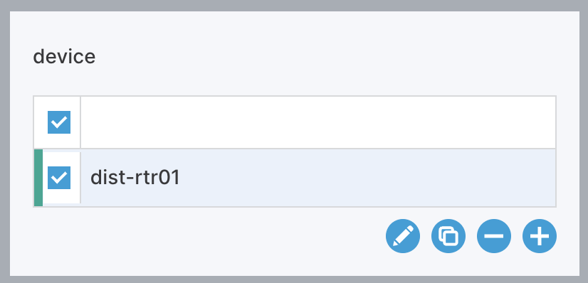

Click **sys** to define the configurations to apply.

Click **dns**.

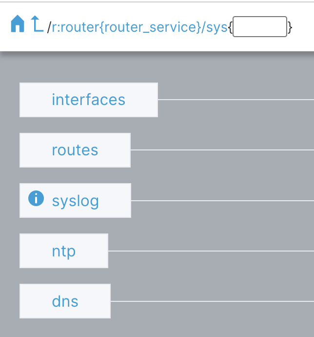

Add an NTP **server** configuration by clicking the **+** button.

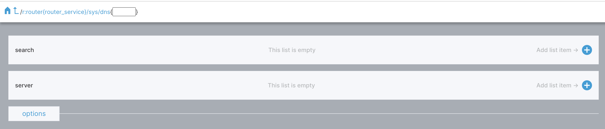

Enter an address like **1.2.3.4** and click **Confirm**.

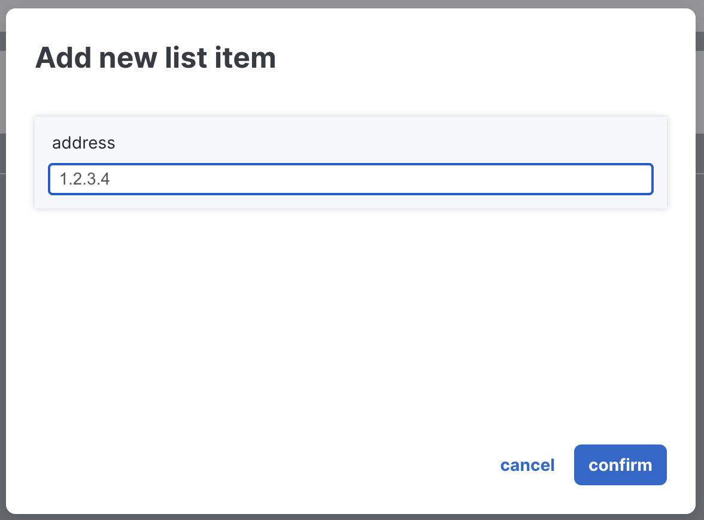

You should see the number **3** near the **Launchpad** icon (top right), indicating pending changes. Click on it.

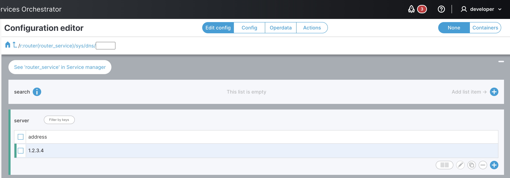

Select the **Config** tab to see the configuration diff — what will be sent to the device and saved in the NSO CDB.

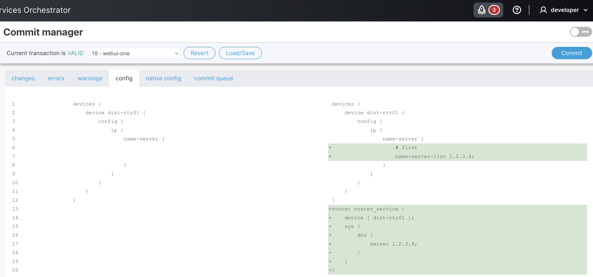

Click **Commit**, then **Yes, commit**.

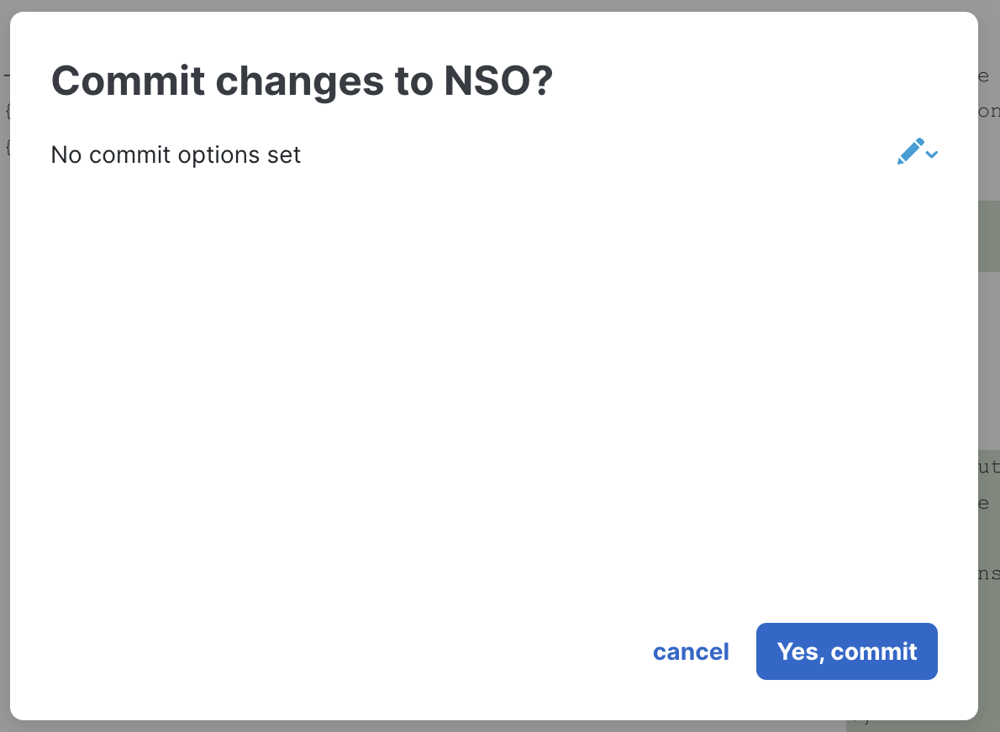

> If you selected multiple devices, the same configuration will be sent to all of them in a single transaction.
