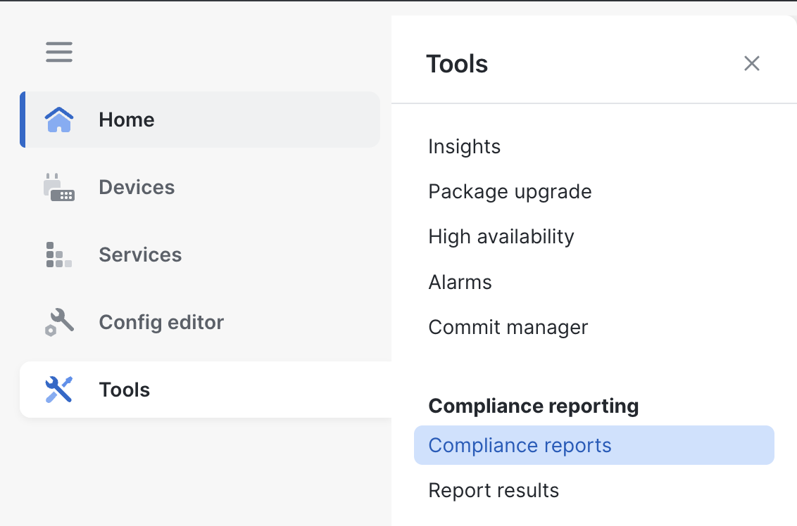
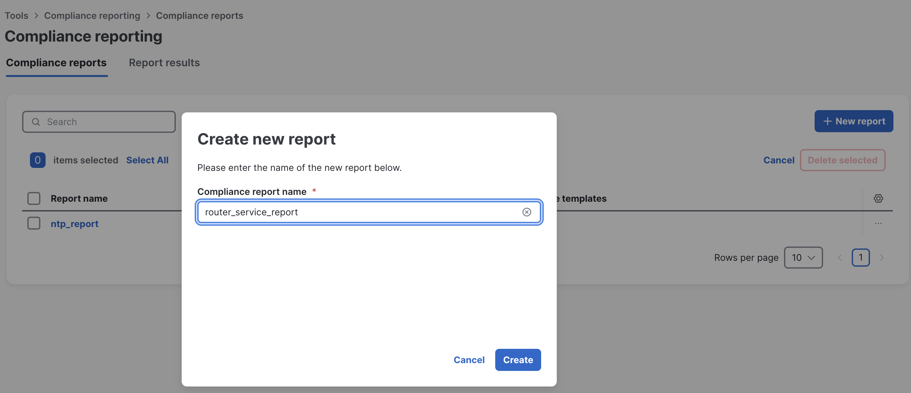
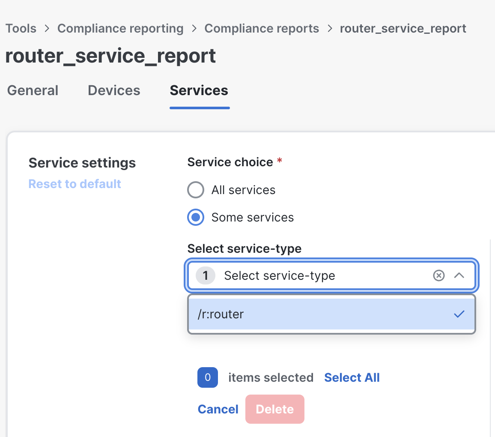
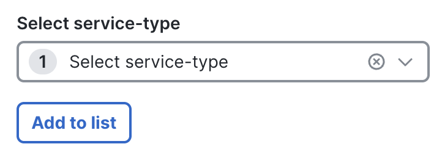
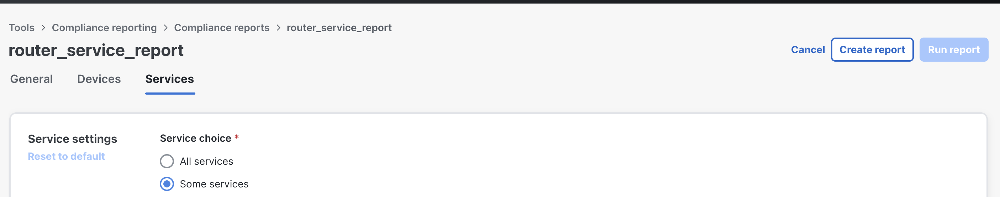
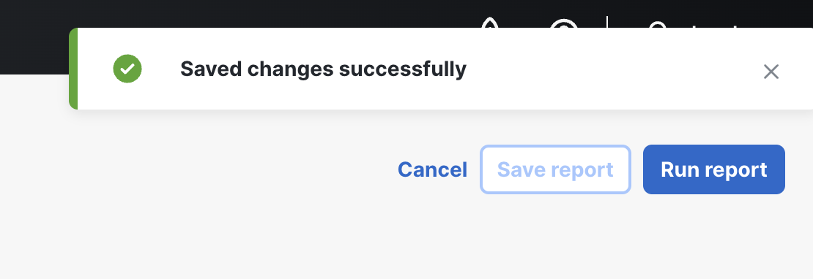
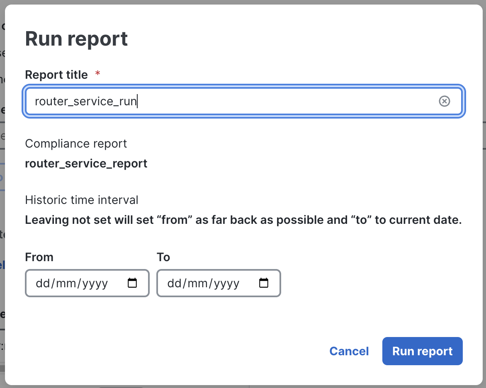
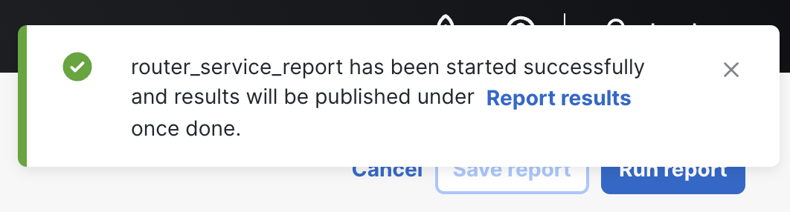
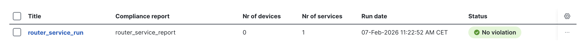
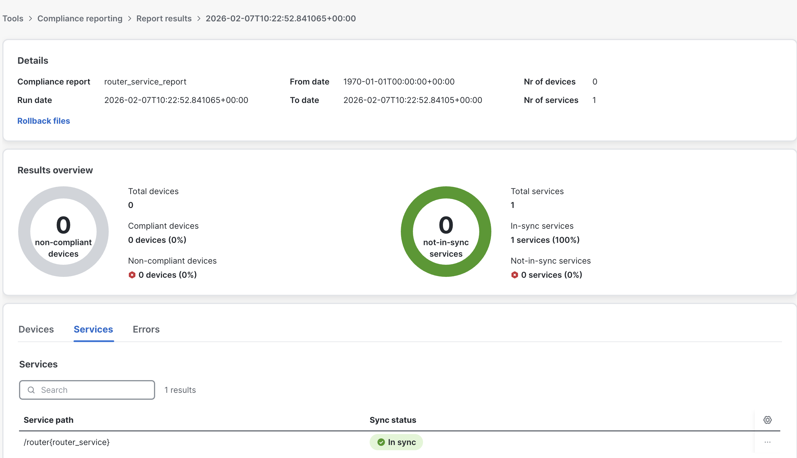

In this task you will create a compliance report to validate the service configurations on the devices. Unlike template-based compliance, service compliance checks whether the device state matches the service definition.

In the left menu, go to **Tools** and open **Compliance Reports**.

Click **+New Report** and name it **router_service_report**. Click **Create**.

Go to the **Services** tab. Select **Some services**, then choose the **r:router** service type.

Click **Add to list**.

Click **Create Report** (top right).

After you see **Saved changes successfully**, click **Run report**.

Name it **router_service_run** and click **Run report**.

Navigate to **Report results**.

The report is compliant because no changes were made on the device after the service was applied.

Opening the report shows the detailed results.

